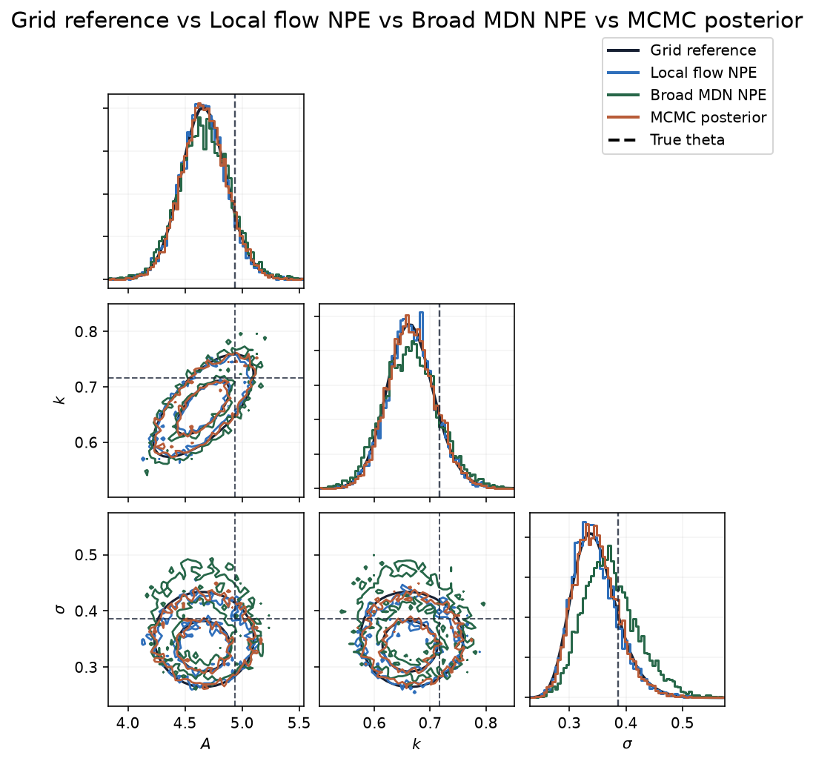
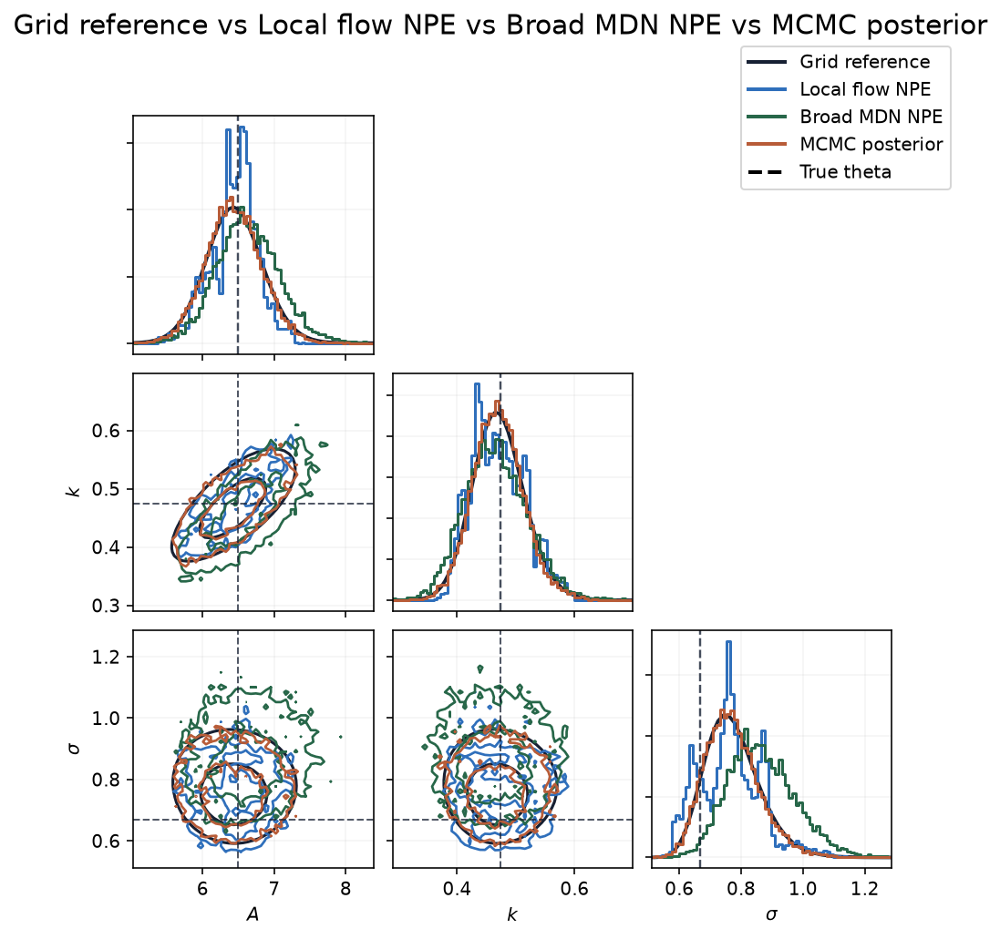

# Neural Posterior Estimation Faithfulness Tests

This repository studies neural posterior estimation (NPE) on small
simulation-based inference problems. The experiments train neural conditional
density estimators and compare their posteriors with independent posterior
references.

The basic simulator setup is:

```math
\theta \sim p(\theta), \qquad x \sim p(x \mid \theta).
```

For a fixed observed signal $x_0$, the Bayesian target is:

```math
p(\theta \mid x_0)
=
\frac{p(x_0 \mid \theta)p(\theta)}
{\int p(x_0 \mid \vartheta)p(\vartheta)\,d\vartheta}.
```

NPE trains a conditional density estimator $q_\phi(\theta \mid x)$ from
simulated pairs:

```math
\max_\phi\;
\mathbb E_{\theta \sim p(\theta),\,x \sim p(x \mid \theta)}
\left[\log q_\phi(\theta \mid x)\right].
```

After training, the object under test is $q_\phi(\theta \mid x_0)$.

## Evaluation

The reference posterior is computed with exact numerical grids where dimension
permits it, exact-likelihood random-walk Metropolis MCMC, and exact-likelihood
HMC. MCMC and HMC use the same prior and likelihood as the simulator under
test.

For a diagnostic parameterization $g(\theta)$, the main scalar comparison is
mean marginal normalized Wasserstein distance:

```math
D(q, p_{\mathrm{ref}})
=
\frac{1}{d}
\sum_{j=1}^{d}
\frac{
W_1\!\left(g_j(\theta_q), g_j(\theta_{\mathrm{ref}})\right)
}{
\mathrm{sd}_{p_{\mathrm{ref}}}\!\left(g_j(\theta)\right)
}.
```

The symbols in this diagnostic are:

- $p_{\mathrm{ref}}(\theta \mid x_0)$: the reference posterior for the fixed
  observed signal $x_0$.
- $q(\theta \mid x_0)$: the learned posterior being evaluated, usually an NPE
  flow posterior.
- $\theta_q$: samples drawn from $q(\theta \mid x_0)$.
- $\theta_{\mathrm{ref}}$: samples drawn from, or weighted grid points
  representing, $p_{\mathrm{ref}}(\theta \mid x_0)$.
- $g(\theta)$ is the diagnostic parameterization used for comparison; it may
  be the raw parameter vector, a physical-parameter transform, or a
  symmetry-aware transform. $g_j(\theta)$ is coordinate $j$ of that diagnostic
  vector, and $d$ is the number of diagnostic coordinates.
- $W_1(a,b)$: the one-dimensional Wasserstein-1 distance between two scalar
  distributions. For distributions with cumulative distribution functions
  $F_a$ and $F_b$, it is:

```math
W_1(a,b)
=
\int_{-\infty}^{\infty}
\left|F_a(t)-F_b(t)\right|\,dt.
```

  Equivalently, using quantile functions $F_a^{-1}$ and $F_b^{-1}$:

```math
W_1(a,b)
=
\int_0^1
\left|F_a^{-1}(u)-F_b^{-1}(u)\right|\,du.
```

  In the run summaries, $a$ and $b$ are empirical one-dimensional sample sets
  or weighted grid marginals for one diagnostic coordinate.
- $\mathrm{sd}_{p_{\mathrm{ref}}}(g_j(\theta))$: the posterior standard
  deviation of diagnostic coordinate $j$ under the reference posterior.

The division by the reference standard deviation turns each coordinate's
Wasserstein distance into a scale-free error. The final value averages those
coordinate errors, so parameters measured on different numerical scales can be
reported in one summary.

The diagnostic parameterization is usually the raw parameter vector. Symmetric
models use transformed coordinates such as
$\left(|\theta_1|,\theta_2\right)$ or
$\left(\mu_{\mathrm{low}},\mu_{\mathrm{high}},\sigma\right)$ so that sampler
diagnostics measure posterior shape independently of arbitrary label
assignments.

Each serious run also records acceptance rates, rank-normalized `Rhat`, bulk
and tail effective sample size, trace plots, posterior summaries, corner
overlays, and posterior predictive overlays when the simulator generates
curves.

## Starting A New Model

Begin by writing down the statistical problem before changing code. A new test
case should have a prior, simulator, observation rule, diagnostic coordinates,
and reference plan:

```math
\theta \sim p(\theta),
\qquad
x \sim p(x\mid\theta),
\qquad
x_0 = f(\theta_0,\epsilon_0).
```

The posterior target for the fixed signal $x_0$ is:

```math
p(\theta\mid x_0)
\propto
p(x_0\mid\theta)p(\theta).
```

Define the parameterization used for numerical comparison at the same time:

```math
g:\Theta\to\mathbb R^d.
```

For an identifiable model, $g(\theta)$ is often the raw parameter vector. For a
model with signs, labels, ridges, or ordered components, choose $g$ so that the
comparison measures the statistical posterior rather than an arbitrary
coordinate convention.

Then implement the smallest exact-likelihood test loop that can answer whether
NPE is faithful:

1. Add the simulator, prior sampler, likelihood, context summary, display
   transform, and diagnostic transform. Simple stress tests usually belong in
   `scripts/npe_flow_stress_tests.py`; decay-style models with specialized
   references can use a dedicated script.
2. Pick a fixed truth $\theta_0$ and generate one observed signal $x_0$. Keep
   this signal fixed while comparing methods, otherwise the reference target is
   changing between runs.
3. Build an independent reference posterior. Use a grid when $d$ is small
   enough for direct quadrature; otherwise use exact-likelihood MCMC or HMC and
   check trace behavior, acceptance, `Rhat`, and effective sample size.
4. Run a smoke NPE experiment first. It should verify that the simulator,
   context, neural posterior, sampling code, and plotting code all work before
   spending time on a larger run.
5. Run the serious NPE fit and compare posterior samples with the reference
   using the normalized Wasserstein diagnostic $D(q,p_{\mathrm{ref}})$ already
   defined above. Inspect marginal overlays, corner plots, posterior
   predictive overlays, and any model-specific mode or symmetry diagnostics.
6. Decide the run status from the reference comparison. A passing run should
   match the posterior target in the diagnostic coordinates and should not rely
   only on visually plausible predictive curves.
7. Record the run command, target, metric, plots, and conclusion in the run
   README, then update the root README only when the result changes the
   project-level understanding of that model.

Useful entry points are:

```sh
uv run scripts/npe_flow_stress_tests.py --help
uv run scripts/check_faithfulness_target.py
uv run scripts/build_runs_view.py
```

## Models And Progress

### Single-Exponential Decay

The base model is a noisy exponential decay curve:

```math
y_i = A\exp(-k t_i) + \epsilon_i,
\qquad
\epsilon_i \sim \mathcal N(0,\sigma^2).
```

The parameter vector is $\theta=(A,k,\sigma)$. The code samples and evaluates
the posterior in log coordinates:

```math
z=(\log A,\log k,\log\sigma),
\qquad
z \sim \mathcal N\!\left(
\log(4.0,0.50,0.40),
\mathrm{diag}(0.8^2,0.8^2,0.8^2)
\right).
```

The fixed synthetic truth used by the main reference scripts is:

```math
(A,k,\sigma)=(5.0,0.55,0.35).
```

Progress: this is the reference success case. Local flow NPE has a calibrated
passing run against the grid/MCMC/HMC target. ABC-assisted correction also
produces faithful posterior samples, with the neural posterior used to focus
the proposal. Broad prior-amortized NPE, hard local MDNs, and sequential SNPE
runs remain useful diagnostics because they show how visually close posteriors
can still miss reference-level accuracy.

Best posterior:
[local_q0005_linear_150k_t8_seed20260706 summary](runs/01_exponential_decay/03_npe_flow_search/11_npe_flow_local_q0005_linear_150k_t8_seed20260706/results/npe_flow_decay_summary.json).

First, the observed $x_0$ signal and posterior predictive fit:


Then, the corresponding best posterior overlay:


### Sign-Symmetry Stress Test

This model creates a two-mode posterior by observing a squared parameter:

```math
x =
\begin{bmatrix}
\theta_1^2 \\
\theta_2
\end{bmatrix}
+ \epsilon,
\qquad
\epsilon \sim \mathcal N\!\left(
0,
\mathrm{diag}(0.22^2,0.16^2)
\right).
```

The prior is:

```math
\theta \sim \mathcal N\!\left(
0,
\mathrm{diag}(1.8^2,1.8^2)
\right).
```

The benchmark observation is generated from:

```math
\theta_0=(0.85,-0.45).
```

The posterior is symmetric in the sign of $\theta_1$. The diagnostic
coordinates are:

```math
g(\theta)=(|\theta_1|,\theta_2).
```

Progress: the calibrated grid-faithful run trains the flow on
$\left(|\theta_1|,\theta_2\right)$, then restores sign symmetry by randomly assigning
the sign of $\theta_1$ after sampling. This run passes the exact-grid
diagnostic target and has good mode-mass behavior.

Best posterior:
[sign_absfold_q008_linear summary](runs/02_stress_sign/01_npe_flow/21_npe_flow_stress_tests_sign_absfold_q008_linear/results/sign_summary.json).


### Banana Stress Test

This model bends an otherwise simple two-dimensional posterior:

```math
x =
\begin{bmatrix}
\theta_1 \\
\theta_2 + b(\theta_1^2-c)
\end{bmatrix}
+ \epsilon,
\qquad
b=0.65,\quad c=0.70.
```

The observation noise and prior are:

```math
\epsilon \sim \mathcal N\!\left(
0,
\mathrm{diag}(0.20^2,0.18^2)
\right),
\qquad
\theta \sim \mathcal N\!\left(
0,
\mathrm{diag}(1.8^2,1.8^2)
\right).
```

The benchmark observation is generated from:

```math
\theta_0=(0.90,-0.25).
```

The diagnostic coordinates are the raw coordinates:

```math
g(\theta)=(\theta_1,\theta_2).
```

Progress: the best run has MCMC, HMC, and NPE in close pairwise agreement and
uses a tighter local NPE region with linear target adjustment. It is currently
a legacy pairwise pass. The remaining work is model-specific calibration
against a truth/reference target.

Best posterior:
[banana_q008 summary](runs/03_stress_banana/01_npe_flow/03_npe_flow_stress_tests_banana_q008/results/banana_summary.json).


### Label-Switching Mixture

This model has exchangeable component labels:

```math
x_i \sim
\frac{1}{2}\mathcal N(\mu_1,\sigma^2)
+
\frac{1}{2}\mathcal N(\mu_2,\sigma^2),
\qquad
i=1,\ldots,80.
```

The code parameterizes noise in log coordinates:

```math
z=(\mu_1,\mu_2,\log\sigma),
\qquad
z \sim \mathcal N\!\left(
(0,0,\log 0.45),
\mathrm{diag}(2.2^2,2.2^2,0.55^2)
\right).
```

The benchmark observation is generated from:

```math
(\mu_1,\mu_2,\sigma)=(-1.25,1.15,0.34).
```

The raw posterior is invariant to swapping $\mu_1$ and $\mu_2$. The
diagnostic coordinates sort the component means:

```math
g(z)=(\mu_{\mathrm{low}},\mu_{\mathrm{high}},\sigma),
\qquad
\mu_{\mathrm{low}}=\min(\mu_1,\mu_2),
\quad
\mu_{\mathrm{high}}=\max(\mu_1,\mu_2).
```

Progress: the best run trains in ordered coordinates, restores random label
assignment after sampling, and uses EM-based context summaries. Sorted
diagnostics pass and pairwise agreement is strong. Final status remains a
legacy pairwise pass until model-specific calibration is added.

Best posterior:
[label_em summary](runs/04_stress_label_switch/01_npe_flow/05_npe_flow_stress_tests_label_em/results/label_switch_summary.json).


### Linear6 Stress Test

This model tests smooth higher-dimensional inference. The simulator is:

```math
y_i =
\sum_{j=1}^{6} w_j \phi_j(t_i)
+ \epsilon_i,
\qquad
\epsilon_i \sim \mathcal N(0,\sigma^2),
\qquad
i=1,\ldots,32.
```

The basis functions are an orthonormalized version of:

```math
1,\quad
t-\frac{1}{2},\quad
\sin(2\pi t),\quad
\cos(2\pi t),\quad
\sin(4\pi t),\quad
\cos(4\pi t).
```

The parameterization and prior are:

```math
z=(w_1,\ldots,w_6,\log\sigma),
\qquad
w_j \sim \mathcal N(0,1.25^2),
\qquad
\log\sigma \sim \mathcal N(\log 0.25,0.50^2).
```

The benchmark observation is generated from:

```math
(w_1,\ldots,w_6,\sigma)
=
(0.70,-0.35,0.80,-0.20,0.35,0.12,0.20).
```

The diagnostic coordinates are:

```math
g(z)=(w_1,\ldots,w_6,\sigma).
```

Progress: the best run has converged MCMC/HMC references and close NPE
pairwise agreement after tuning the random-walk proposal and using a tighter
local NPE region. It is a legacy pairwise pass pending model-specific
calibration.

Best posterior:
[linear6_q008 summary](runs/05_stress_linear6/01_npe_flow/13_npe_flow_stress_tests_linear6_q008/results/linear6_summary.json).


### Ordered Two-Exponential Decay

This model is the current hard case:

```math
y_i =
A_1\exp(-k_1 t_i)
+
A_2\exp(-k_2 t_i)
+
\epsilon_i,
\qquad
\epsilon_i \sim \mathcal N(0,\sigma^2).
```

The ordered variant enforces $k_2>k_1$ through the code parameterization:

```math
z=(\log A_1,\log k_1,\log A_2,\log\Delta k,\log\sigma),
\qquad
k_2 = k_1 + \Delta k,
\qquad
\Delta k=\exp(\log\Delta k).
```

The current ordered prior is:

```math
z \sim \mathcal N\!\left(
(\log 2.5,\log 0.35,\log 1.4,\log 0.75,\log 0.25),
\mathrm{diag}(0.60^2,0.55^2,0.65^2,0.60^2,0.45^2)
\right).
```

The benchmark observation is generated from:

```math
(A_1,k_1,A_2,k_2,\sigma)
=
(2.7,0.32,1.35,1.22,0.18).
```

The diagnostic coordinates are the displayed physical parameters:

```math
g(z)=(A_1,k_1,A_2,k_2,\sigma).
```

Progress: MCMC and HMC agree well on the best current run. NPE remains outside
the reference agreement level. The best custom-flow result used a profiled
two-rate least-squares summary and a residual-centered NPE target. Further
attempts with broader and tighter local regions, proposal NPE, whitening,
ridge coordinates, raw-curve context, and `sbi` SNPE-C have left the gap
unresolved.

Best posterior:
[two_exp_ordered_residual summary](runs/06_two_exponential/01_npe_flow/12_npe_flow_stress_tests_two_exp_ordered_residual/results/two_exp_ordered_summary.json).


## Decay Amortization Check

The single-decay best posterior above is the main calibrated result at the
observed signal $x_0$. The following two plots are a separate diagnostic. They
compare four posterior layers on fresh signals: local NPE, global/broad NPE,
MCMC, and grid reference.

This section asks how much of the posterior map has been amortized. The global
or broad NPE is trained on the full joint simulator distribution:

```math
p_{\mathrm{broad}}(\theta,x)
=
p(\theta)p(x\mid\theta).
```

Its training objective is:

```math
\phi_{\mathrm{broad}}
=
\arg\max_\phi
\mathbb E_{(\theta,x)\sim p_{\mathrm{broad}}}
\left[
\log q_\phi(\theta\mid x)
\right],
```

and the learned posterior used in the plots is:

```math
q_{\phi,\mathrm{broad}}(\theta\mid x_\star).
```

The local NPE is trained on the simulator distribution restricted to a region
around $x_0$. Once the local event $R$ is defined below, its training
distribution is:

```math
p_{\mathrm{local}}(\theta,x)
=
p_R(\theta,x)
=
\frac{
p(\theta)p(x\mid\theta)\mathbf 1\{x\in R\}
}{
\Pr(x\in R)
}.
```

Its training objective is:

```math
\phi_{\mathrm{local}}
=
\arg\max_\phi
\mathbb E_{(\theta,x)\sim p_{\mathrm{local}}}
\left[
\log q_\phi(\theta\mid x)
\right],
```

and the learned posterior used in the plots is:

```math
q_{\phi,\mathrm{local}}(\theta\mid x_\star).
```

The local NPE is trained over a restricted prior-predictive region around
$x_0$. In this decay run, $s(x)$ is an indirect exponential-fit summary. For a
candidate signal $x=(x_1,\ldots,x_n)$ observed at times
$t=(t_1,\ldots,t_n)$, the summary first profiles a one-exponential curve over
decay rates $k$.

For each fixed $k$, the least-squares amplitude is:

```math
\widehat A(k;x)
=
\frac{
\sum_{i=1}^{n} x_i\exp(-k t_i)
}{
\sum_{i=1}^{n}\exp(-2k t_i)
}.
```

The profiled squared error is:

```math
\mathrm{SSE}(k;x)
=
\sum_{i=1}^{n}
\left[
x_i-\widehat A(k;x)\exp(-k t_i)
\right]^2.
```

The fitted decay rate is the grid-profile minimizer:

```math
\widehat k(x)
=
\arg\min_{k\in\mathcal K}\mathrm{SSE}(k;x),
```

with a small quadratic interpolation around the best grid point. The fitted
noise scale is:

```math
\widehat\sigma(x)
=
\sqrt{\frac{\mathrm{SSE}(\widehat k(x);x)}{n}}.
```

The context summary used for the local region is then:

```math
s(x)
=
\left(
\log\widehat A(\widehat k(x);x),
\log\widehat k(x),
\log\widehat\sigma(x)
\right).
```

The local region is defined by a standardized distance in this three-dimensional
summary space. Let $c$ and $a$ be the pilot prior-predictive center and scale
vectors for $s(x)$. The distance used in the code is:

```math
d_s(x,x_0)
=
\sqrt{
\frac{1}{3}
\sum_{\ell=1}^{3}
\left[
\frac{s_\ell(x)-c_\ell}{a_\ell}
-
\frac{s_\ell(x_0)-c_\ell}{a_\ell}
\right]^2
}.
```

The local training event is:

```math
R=\{x: d_s(x,x_0)\le r\}.
```

For any evaluation signal $x_\star$ inside the region, conditioning on
$x_\star$ removes the selection event because $R$ depends only on $x$:

```math
p_R(\theta\mid x_\star)
=
p(\theta\mid x_\star),
\qquad x_\star\in R.
```

For a signal outside the region, the same local network is being evaluated
outside the distribution it was trained on:

```math
x_\star \notin R,
\qquad
q_{\phi,\mathrm{local}}(\theta\mid x_\star)
\text{ is extrapolation.}
```

The first plot checks interpolation inside the local amortization region. The
second checks how the same local estimator behaves on a prior-predictive signal
outside that region, where the broad estimator is the more naturally amortized
model. The grid and MCMC layers remain exact-likelihood references for each
fresh signal.

Local-region signal:



[Local-region signal predictive overlay](runs/00_shared_assets/readme_decay_posteriors/decay_local_region_posterior_signal.png)

Away-from-$x_0$ prior-predictive signal:



[Away-from-x0 signal predictive overlay](runs/00_shared_assets/readme_decay_posteriors/decay_away_from_x0_posterior_signal.png)

The generated metadata for these two diagnostic views is stored in
[decay_readme_posteriors_summary.json](runs/00_shared_assets/readme_decay_posteriors/decay_readme_posteriors_summary.json).

## Main Reports

- [NPE faithfulness investigation report](notes/npe-faithfulness-investigation-report.md)
- [NPE flow stress-test results](notes/npe-flow-stress-test-results.md)
- [Sign target calibration](notes/sign-target-calibration.md)
- [ABC faithfulness repair results](notes/abc-faithfulness-repair-results.md)
- [Calibrated successful and reference runs](runs/00_successful_runs/README.md)
- [All run statuses](runs/README.md)

## Common Commands

Run Python scripts with `uv run`:

```sh
uv run scripts/check_faithfulness_target.py
uv run scripts/calibrate_sign_target.py
uv run scripts/npe_flow_stress_tests.py --help
uv run scripts/build_runs_view.py
```

## UI Summary

The interactive posterior viewer supports the single-exponential decay
diagnostics. It lets you draw signals, toggle local and broad NPE layers,
compare against grid and MCMC references, and inspect corner plots, predictive
plots, posterior quantiles, local-region status, Wasserstein-to-grid distances,
and runtime diagnostics.

To run the built viewer:

```sh
cd viewer-ui
npm install
npm run build
cd ..
uv run scripts/npe_posterior_viewer.py
```

For frontend development, run the backend and Vite dev server separately:

```sh
uv run scripts/npe_posterior_viewer.py
```

```sh
cd viewer-ui
npm run dev
```
