# Neural Posterior Estimation Faithfulness Tests

This repository studies neural posterior estimation (NPE) on small
simulation-based inference problems. The experiments train neural conditional
density estimators and compare their posteriors with independent posterior
references.

The basic simulator setup is:

```math
\theta \sim p(\theta), \qquad x \sim p(x \mid \theta).
```

For a requested observed signal $`x_\star`$, the Bayesian target is:

```math
p(\theta \mid x_\star)
=
\frac{p(x_\star \mid \theta)p(\theta)}
{\int p(x_\star \mid \vartheta)p(\vartheta)\,d\vartheta}.
```

NPE trains a conditional density estimator $`q_\phi(\theta \mid x)`$ from
simulated pairs:

```math
\max_\phi\;
\mathbb E_{\theta \sim p(\theta),\,x \sim p(x \mid \theta)}
\left[\log q_\phi(\theta \mid x)\right].
```

After training, the object under test is $`q_\phi(\theta \mid x_\star)`$.

## Evaluation

The reference posterior is computed with exact numerical grids where dimension
permits it, exact-likelihood random-walk Metropolis Markov chain Monte Carlo
(MCMC), and exact-likelihood Hamiltonian Monte Carlo (HMC). MCMC and HMC use
the same prior and likelihood as the simulator under test.

For a diagnostic parameterization $`g(\theta)`$, the main scalar comparison is
mean marginal normalized Wasserstein distance:

```math
D(q, p_{\mathrm{ref}})
=
\frac{1}{d}
\sum_{j=1}^{d}
\frac{
W_1\!\left(g_j(\theta_q), g_j(\theta_{\mathrm{ref}})\right)
}{
\mathrm{sd}_{p_{\mathrm{ref}}}\!\left(g_j(\theta)\right)
}.
```

The symbols in this diagnostic are:

- $`p_{\mathrm{ref}}(\theta \mid x_\star)`$: the reference posterior for the
  requested observed signal $`x_\star`$.
- $`q(\theta \mid x_\star)`$: the learned posterior being evaluated, usually an NPE
  flow posterior.
- $`\theta_q`$: samples drawn from $`q(\theta \mid x_\star)`$.
- $`\theta_{\mathrm{ref}}`$: samples drawn from, or weighted grid points
  representing, $`p_{\mathrm{ref}}(\theta \mid x_\star)`$.
- $`g(\theta)`$ is the diagnostic parameterization used for comparison; it may
  be the raw parameter vector, a physical-parameter transform, or a
  symmetry-aware transform. $`g_j(\theta)`$ is coordinate $`j`$ of that diagnostic
  vector, and $`d`$ is the number of diagnostic coordinates.
- $`W_1(a,b)`$: the one-dimensional Wasserstein-1 distance between two scalar
  distributions. For distributions with cumulative distribution functions
  $`F_a`$ and $`F_b`$, it is:

```math
W_1(a,b)
=
\int_{-\infty}^{\infty}
\left|F_a(t)-F_b(t)\right|\,dt.
```

  Equivalently, using quantile functions $`F_a^{-1}`$ and $`F_b^{-1}`$:

```math
W_1(a,b)
=
\int_0^1
\left|F_a^{-1}(u)-F_b^{-1}(u)\right|\,du.
```

  In the run summaries, $a$ and $b$ are empirical one-dimensional sample sets
  or weighted grid marginals for one diagnostic coordinate.
- $`\mathrm{sd}_{p_{\mathrm{ref}}}(g_j(\theta))`$: the posterior standard
  deviation of diagnostic coordinate $`j`$ under the reference posterior.

The division by the reference standard deviation turns each coordinate's
Wasserstein distance into a scale-free error. The final value averages those
coordinate errors, so parameters measured on different numerical scales can be
reported in one summary.

The diagnostic parameterization is usually the raw parameter vector. Symmetric
models use transformed coordinates such as
$`\left(|\theta_1|,\theta_2\right)`$ or
$`\left(\mu_{\mathrm{low}},\mu_{\mathrm{high}},\log\sigma\right)`$ so that sampler
diagnostics measure posterior shape independently of arbitrary label
assignments.

Each serious run also records acceptance rates, rank-normalized `Rhat`, bulk
and tail effective sample size, trace plots, posterior summaries, corner
overlays, and posterior predictive overlays when the simulator generates
curves.

### Population NLL Entropy Floors

For population validation NLL, the Bayes-optimal conditional density is the
exact posterior $`p(\theta\mid x)`$. The irreducible loss is the conditional
population entropy:

```math
\mathcal L_\star
=
\mathbb E_{p(\theta,x)}
\left[
-\log p(\theta\mid x)
\right]
=
H(\theta\mid X).
```

This floor is coordinate-specific: compare an NPE validation NLL only with the
floor for the same density target parameterization.

| Model | Density target coordinates | Population NLL floor |
| --- | --- | ---: |
| Single-exponential decay | $`z=(\log A,\log k,\log\sigma)`$ | `-3.63865 +/- 0.00253` |
| Sign-symmetry stress | $`\theta=(\theta_1,\theta_2)`$ | `-0.73379 +/- 0.00115` |
| Sign-symmetry stress, folded target | $`(\lvert\theta_1\rvert,\theta_2)`$ | `-1.42694 +/- 0.00115` |
| Banana stress | $`\theta=(\theta_1,\theta_2)`$ | `-0.52826 +/- 0.00100` |
| Label-switching mixture | $`z_{\mathrm{sorted}}=(\mu_{\mathrm{low}},\mu_{\mathrm{high}},\log\sigma)`$ | `-3.10112 +/- 0.00821` |
| Linear6 stress | $`z=(w_1,\ldots,w_6,\log\sigma)`$ | `-10.78631 +/- 0.00353` |

The single-decay estimate is the adaptive posterior-centered Gauss-Hermite
oracle recorded in
[npe-decay-bayes-entropy-high-precision.md](notes/npe-decay-bayes-entropy-high-precision.md)
and
[decay_bayes_entropy_adaptive_gh13_full1m.json](runs/00_shared_assets/readme_scaling/decay_bayes_entropy_adaptive_gh13_full1m.json).
The sign estimate is generated by
`scripts/estimate_sign_bayes_entropy.py` and stored in
[sign_bayes_entropy_hybrid_1m.json](runs/00_shared_assets/readme_entropy/sign_bayes_entropy_hybrid_1m.json).
The folded sign floor is lower than the raw-coordinate sign floor by
$`\log 2`$ because the posterior sign is exactly symmetric. A compact table is
also stored in
[population_entropy_floors.json](runs/00_shared_assets/readme_entropy/population_entropy_floors.json).
The Linear6 floor is computed by the population NPE evaluator using the
linear-Gaussian conditional posterior and one-dimensional Gauss-Hermite
evidence integration over $`\log\sigma`$.
The Banana floor integrates $`\theta_2`$ analytically and then uses
one-dimensional Gauss-Hermite evidence integration over $`\theta_1`$.
The Label Switching floor is evaluated in sorted coordinates. For each signal,
the raw evidence is estimated with a symmetric Gaussian-mixture importance
proposal over the two label permutations, and the sorted density includes the
$`\log 2`$ fold factor. This estimator is expensive enough that the committed
floor uses the `50k` validation cache from the population run rather than the
`1M` caches used for the analytic floors.

Finite validation-cache NLLs have their own Monte Carlo uncertainty. For the
two single-decay NPEs listed below, the full 1M-example cache standard errors
are about `0.00252`, or roughly `+/-0.00495` for a 95% Monte Carlo half-width.
The oracle floor has comparable finite-cache uncertainty (`+/-0.00253`). The
4-member ensemble and convex-weighted density ensemble are therefore close
enough that the density ensemble's `0.00059` measured NLL advantage should not
be interpreted as a resolved population-level ordering without a larger
validation estimate. The cache uncertainty calculation is stored in
[decay_population_npe_validation_nll_uncertainty.json](runs/00_shared_assets/readme_scaling/decay_population_npe_validation_nll_uncertainty.json).

## Starting A New Model

Begin by writing down the statistical problem before changing code. A new test
case should have a prior, simulator, observation rule, diagnostic coordinates,
and reference plan:

```math
\theta \sim p(\theta),
\qquad
x \sim p(x\mid\theta),
\qquad
x_\star = f(\theta_\star,\epsilon_\star).
```

The posterior target for the requested signal $`x_\star`$ is:

```math
p(\theta\mid x_\star)
\propto
p(x_\star\mid\theta)p(\theta).
```

Define the parameterization used for numerical comparison at the same time:

```math
g:\Theta\to\mathbb R^d.
```

For an identifiable model, $`g(\theta)`$ is often the raw parameter vector. For a
model with signs, labels, ridges, or ordered components, choose $`g`$ so that the
comparison measures the statistical posterior rather than an arbitrary
coordinate convention.

Then implement the smallest exact-likelihood test loop that can answer whether
NPE is faithful:

1. Add the simulator, prior sampler, likelihood, context summary, display
   transform, and diagnostic transform. Simple stress tests usually belong in
   `scripts/npe_flow_stress_tests.py`; decay-style models with specialized
   references can use a dedicated script.
2. Pick a truth $`\theta_\star`$ and generate one observed signal $`x_\star`$. Keep
   this signal fixed while comparing methods, otherwise the reference target is
   changing between runs.
3. Build an independent reference posterior. Use a grid when $`d`$ is small
   enough for direct quadrature; otherwise use exact-likelihood MCMC or HMC and
   check trace behavior, acceptance, `Rhat`, and effective sample size.
4. Run a smoke NPE experiment first. It should verify that the simulator,
   context, neural posterior, sampling code, and plotting code all work before
   spending time on a larger run.
5. Run the serious NPE fit and compare posterior samples with the reference
   using the normalized Wasserstein diagnostic $`D(q,p_{\mathrm{ref}})`$ already
   defined above. Inspect marginal overlays, corner plots, posterior
   predictive overlays, and any model-specific mode or symmetry diagnostics.
6. Decide the run status from the reference comparison. A passing run should
   match the posterior target in the diagnostic coordinates and should not rely
   only on visually plausible predictive curves.
7. Record the run command, target, metric, plots, and conclusion in the run
   README, then update the root README only when the result changes the
   project-level understanding of that model.

Useful entry points are:

```sh
uv run scripts/npe_flow_stress_tests.py --help
uv run scripts/check_faithfulness_target.py
uv run scripts/build_runs_view.py
```

## Models And Progress

### Single-Exponential Decay

The base model is a noisy exponential decay curve:

```math
y_i = A\exp(-k t_i) + \epsilon_i,
\qquad
\epsilon_i \sim \mathcal N(0,\sigma^2).
```

The parameter vector is $\theta=(A,k,\sigma)$. The code samples and evaluates
the posterior in log coordinates:

```math
z=(\log A,\log k,\log\sigma),
\qquad
z \sim \mathcal N\!\left(
\log(4.0,0.50,0.40),
\mathrm{diag}(0.8^2,0.8^2,0.8^2)
\right).
```

The single-decay estimator is a population-trained neural posterior estimator
(NPE). It learns a conditional density for signals sampled from the same
population used by the simulator:

```math
p_{\mathrm{train}}(\theta,x)=p(\theta)p(x\mid\theta),
```

with objective

```math
\phi_{\mathrm{train}}
=
\arg\max_\phi
\mathbb E_{(\theta,x)\sim p_{\mathrm{train}}}
\left[
\log q_\phi(\theta\mid x)
\right].
```

#### Model Definitions

All reported negative log likelihoods (NLLs) in this section are in the
log-coordinate parameterization $z=(\log A,\log k,\log\sigma)$. Each neural
posterior estimator (NPE) receives a deterministic context vector
$c=f(x)$, then standardizes each context coordinate using training-set mean and
standard deviation before the neural density is evaluated.

The raw-curve context is the 40-dimensional signal itself:

```math
c_{\mathrm{raw}}(x)=(y_1,\ldots,y_{40}).
```

The decay-summary context adds 12 deterministic statistics: the intercept and
negative slope of a least-squares line through
$`\log\max(y_i,10^{-4})`$, the standard deviation of the log residuals, mean,
standard deviation, minimum, maximum, first value, last value, early mean, late
mean, and first-to-last log ratio. The fit-summary context is a coarse
least-squares exponential fit. For a 64-point grid over $`\log k`$ spanning
three prior standard deviations on either side of the prior mean,

```math
\phi_k(t_i)=\exp(-k t_i),
\qquad
\hat A(k)=
\frac{\sum_i y_i\phi_k(t_i)}{\sum_i \phi_k(t_i)^2},
```

and $`k_\star`$ is the grid point with the smallest residual sum of squares
$`\mathrm{SSE}(k)`$. The six fit features are

```math
\left(
\log \hat A(k_\star),
\log k_\star,
\log \hat\sigma,
\log(1+\mathrm{SSE}_\star),
\log(1+\mathrm{SSE}_{2}-\mathrm{SSE}_\star),
d_{\mathrm{edge}}
\right),
```

where $`\hat\sigma=\sqrt{\mathrm{SSE}_\star/40}`$,
$`\mathrm{SSE}_2`$ is the second-best grid SSE, and $`d_{\mathrm{edge}}`$
is the normalized distance of $`k_\star`$ from the grid edge. Thus
`raw_fit_summary` has 46 context features and `raw_decay_fit_summary` has
58 context features.

A mixture density network (MDN) models a finite Gaussian mixture with full
covariances:

```math
q_\phi(z\mid c)
=
\sum_{j=1}^{M}
\pi_j(c)\,
\mathcal N\!\left(z;\mu_j(c),L_j(c)L_j(c)^\top\right).
```

One earlier MDN baseline has $`M=5`$ components, raw-curve context, a
three-hidden-layer SiLU multilayer perceptron (MLP) with width 128, and 44,722
trainable parameters.

A neural spline flow (NSF) represents $`z`$ by an invertible conditional
transformation $`T_\phi(\cdot;c)`$ of a standard normal base variable:

```math
u=T_\phi^{-1}(z;c),
\qquad
q_\phi(z\mid c)
=
\mathcal N(u;0,I)
\left|\det\frac{\partial T_\phi^{-1}(z;c)}{\partial z}\right|.
```

Each NSF transform is a monotonic rational-quadratic spline with 8 bins. In the
names Flow2, Flow3, and Flow4, the number is the number of stacked NSF
transforms. These runs use fully autoregressive NSF transforms; they are not
coupling layers. In this code, coupling-style NSF transforms would correspond
to `flow_passes=2`, which is not used by the models listed here. A residual NSF
means the Zuko masked MLP conditioner inside each autoregressive spline uses
residual hidden blocks. This is separate from the repo's optional residual
target transform, which is not used by the models listed in this section.
Random permutations mean the feature order is randomly permuted between
successive NSF transforms.

An ensemble is a density mixture over trained NPEs:

```math
q_{\mathrm{ens}}(z\mid x)
=
\sum_{m=1}^{M} w_m q_m(z\mid x),
\qquad
w_m\ge 0,\quad \sum_m w_m=1.
```

The ensemble log density is evaluated with `logsumexp` over member log
densities plus $`\log w_m`$. The equal-weight 4-member ensemble has
$`w_m=1/4`$. The convex-weighted 16-member ensemble fits the weights by
minimizing validation NLL on 200,000 validation examples,

```math
\min_{w\in\Delta^{15}}
-
\frac{1}{n}
\sum_{i=1}^{n}
\log
\left(
\sum_{m=1}^{16} w_m q_m(z_i\mid x_i)
\right),
```

then reports NLL on the full 1M validation cache, including an 800,000-example
holdout not used for fitting the weights.

| Model or figure entry | Actual architecture |
| --- | --- |
| 4-member Flow2 residual NSF ensemble in the viewer | Four independently trained NSF members; each member uses `raw_decay_fit_summary` context, two NSF transforms, 8 spline bins, width-80 residual masked-MLP conditioners with two hidden layers, ReLU activation, random inter-transform permutations, and 72,938 trainable parameters. Each member is trained on 2.048M simulations for 15 epochs. |
| 16-member convex-weighted density ensemble in the viewer | Convex mixture of saved NSF checkpoints. The member weights, rounded to four decimals in saved-member order, are `(0.1541, 0.1386, 0.0458, 0.0065, 0.1088, 0.0530, 0.0950, 0.0745, 0.0138, 0.0008, 0.0012, 0.0923, 0.0548, 0.1088, 0.0130, 0.0391)`. The members are Flow2 or Flow3 NSF checkpoints using raw, `raw_fit_summary`, or `raw_decay_fit_summary` context; all use 8 spline bins and width-80, two-hidden-layer conditioners. All but one use residual masked-MLP conditioners. |
| Fixed parameter-count MDN diagnostic | Five-component full-covariance Gaussian MDN with raw-curve context and a width-128, three-hidden-layer SiLU MLP; 44,722 trainable parameters. |
| Fixed parameter-count spline-flow diagnostic | Flow4 NSF with raw-curve context, 8 spline bins, width-64, two-hidden-layer ReLU conditioners, no residual conditioners, no random permutations, and 45,844 trainable parameters. |
| Training-efficiency Flow4 single-model runs | Flow4 NSF single models with raw-curve context. The 90-epoch run uses width 64 and batch 512; the 74-epoch run uses width 80 and batch 1024. |
| Training-efficiency Flow3 single-model run | Flow3 NSF single model with raw-curve context, width 80, batch 1024, 8.192M simulations, and 27 epochs. |
| Earlier 4-member residual NSF ensemble curves | Equal-weight density mixtures of four Flow3 residual NSF members with width-80 conditioners and 8 spline bins; one curve uses raw-curve context, and one adds the six fit-summary features. |

For the 16-member convex-weighted density ensemble, the weight-vector indices
map to member architectures as follows: members 1, 2, 6, and 9 are Flow2
residual NSF models with random permutations and `raw_decay_fit_summary`
context; members 3 and 4 are the same Flow2 residual NSF architecture without
random permutations; members 5, 7, and 8 are Flow3 residual NSF models with
`raw_decay_fit_summary` context; members 10, 11, 15, and 16 are Flow3 residual
NSF models with `raw_fit_summary` context; members 12 and 13 are Flow3
residual NSF models with raw-curve context; member 14 is a Flow3 NSF with
raw-curve context and no residual conditioner. The Flow2 members have 72,938
trainable parameters; the Flow3 residual raw-context members have 105,087; the
Flow3 residual `raw_fit_summary` members have 106,527; the Flow3 residual
`raw_decay_fit_summary` members have 109,407; and the non-residual Flow3
raw-context member has 46,767.

The viewer includes two population-trained NPEs:

| Model | Description | Full validation negative log likelihood (NLL) |
| --- | --- | ---: |
| 4-member ensemble of Flow2 residual neural spline flows (NSFs) with random permutations, raw-curve, decay-summary, and fit-summary context features; 2.048M simulations per member, 15 epochs | Equal-weight density ensemble trained from initialization. | `-3.6306901328125` |
| 16-member convex-weighted density ensemble | Ensemble whose nonnegative weights are fitted on validation data; its measured cache NLL is slightly lower, but the difference is not statistically resolved. | `-3.63128073481036` |

The following prior-predictive signal was sampled from
$`p(\theta)p(x\mid\theta)`$. The plot compares both NPE estimates with an exact
numerical grid and a Markov chain Monte Carlo (MCMC) reference. The mean
normalized marginal Wasserstein distance $`D(q,p_{\mathrm{ref}})`$ is the
diagnostic defined in the Evaluation section. Smaller values mean the posterior
marginals are closer to the exact grid reference. For this signal, the distance
is `0.0597` for the 4-member Flow2 residual NSF ensemble, `0.0592` for the
convex-weighted density ensemble, and `0.0733` for MCMC.

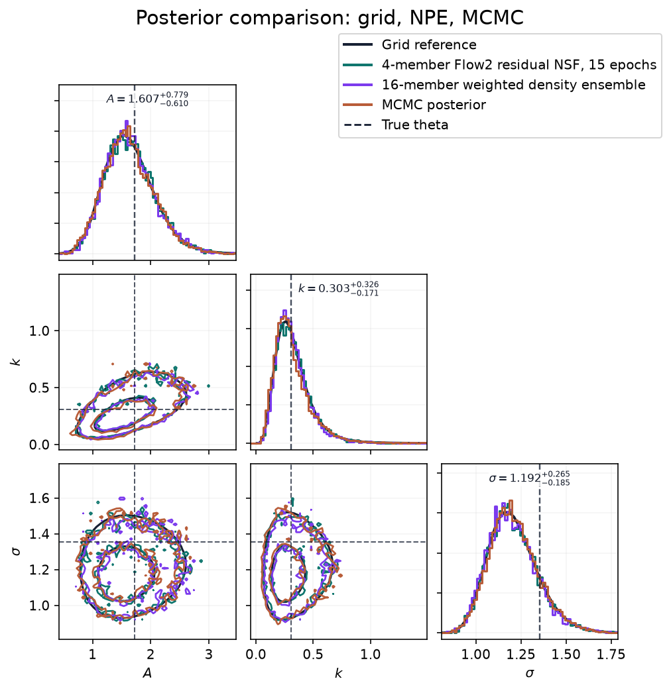

[Single decay population signal predictive overlay](runs/00_shared_assets/readme_decay_posteriors/decay_population_posterior_signal.png)

The low-prior-density stress signal is harder. It was generated from a
parameter vector 4.33 prior standard deviations from the prior mean in
log-parameter space, with log prior density `9.375` below the prior mean. The
4-member Flow2 residual NSF ensemble has mean normalized marginal Wasserstein
distance `0.1868`, the convex-weighted density ensemble has `0.2379`, and
MCMC has `0.0761`. This is a useful counterexample to relying only on average
NLL.

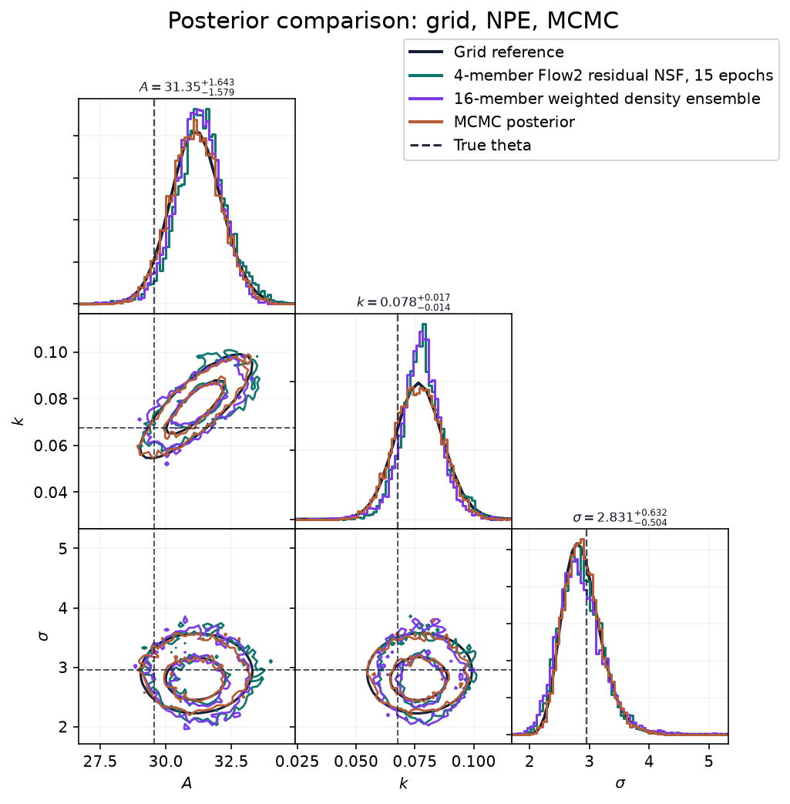

[Single decay low-prior-density signal predictive overlay](runs/00_shared_assets/readme_decay_posteriors/decay_low_prior_stress_posterior_signal.png)

The generated metadata for these diagnostic views is stored in
[decay_population_readme_posteriors_summary.json](runs/00_shared_assets/readme_decay_posteriors/decay_population_readme_posteriors_summary.json).

#### Flow2 Ensemble Data Scaling Diagnostic

The current single-decay data scaling diagnostic holds the deployed 4-member
Flow2 residual NSF ensemble recipe fixed and scales only the number of
simulated training pairs per member. The primary measurement is population
validation NLL. Because this is a continuous-density NLL in normalized `z` units
and can be negative, the companion panel removes the fitted free asymptote from
the raw-loss fit and plots the same fitted residual on a log scale. Posterior
Wasserstein is kept as a separate faithfulness diagnostic, not as the main
scaling-law loss.

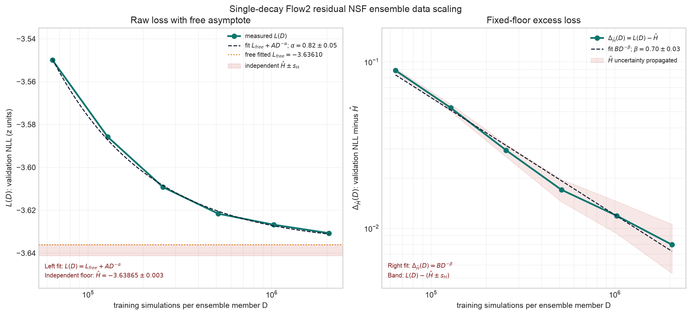

The left panel plots raw validation loss $`L(D)`$ and fits a free-asymptote
scaling curve:

```math
L(D) = L_{\mathrm{free}} + A D^{-\alpha}.
```

The shaded Bayes entropy band in that panel is independent of the fit; it uses
the single-decay population floor from the Evaluation section, not a fitted
constraint. The right panel subtracts the fitted asymptote from the same
left-panel fit:

```math
\Delta_D(D) = L(D) - L_{\mathrm{free}},
\qquad
\Delta_D(D) = A D^{-\alpha}.
```

The right-panel uncertainty band propagates the fitted $`L_{\mathrm{free}}`$
uncertainty. This removes the finite-model floor from the displayed residual;
the independent entropy estimate is shown only as a reference in the raw-loss
panel.

The equal-weight 4-member ensemble improves monotonically from `64k` to
`2.048M` simulations per member. Validation NLL improves from `-3.54993` to
`-3.63069`. A raw-NLL asymptote fit gives `L_free=-3.63610 +/- 0.00165`,
exponent `0.823`, exponent standard error `0.046`, and raw `R2=0.999`. That
fitted asymptote is only `0.00255` above the Bayes entropy estimate, comparable
to the current `+/-0.0026` floor uncertainty; it should not be read as a
resolved residual training floor.

The old entropy-floor excess fit is retained in the summary JSON for audit, but
it is not the displayed scaling-law residual because it mixes the finite-data
term with the gap between $`L_{\mathrm{free}}`$ and $`\hat H`$.

The fixed-panel posterior diagnostic moves in the same direction: panel mean
normalized marginal Wasserstein decreases from `0.11046` to `0.03613`. Full
metadata and rows are stored in
[flow2_ensemble_data_scaling_summary.json](runs/00_shared_assets/readme_scaling/decay_flow2_ensemble_data_scaling_summary.json).

#### Flow2 Ensemble Parameter Scaling Diagnostic

The complementary parameter-scaling diagnostic fixes the data budget at
`D=2,048,000` simulations per ensemble member and varies the conditioner width
of the same 4-member Flow2 residual NSF recipe. This low-width probe uses
`h=4,6,8,12,16`, corresponding to `1,346` through `6,506` trainable parameters
per member.

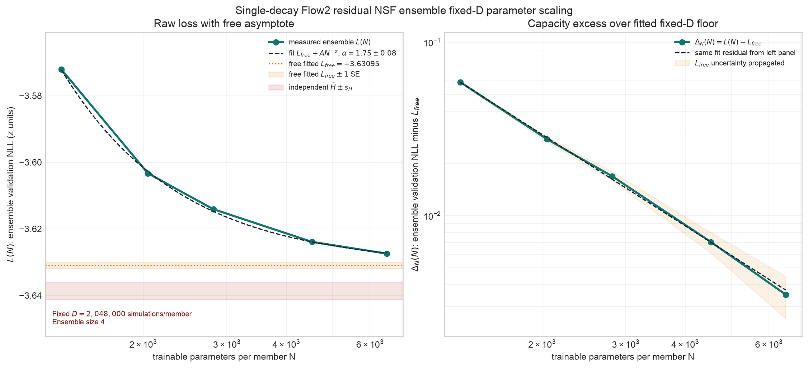

The fitted equation is the analogous fixed-data form:

```math
L(N) = L_{\mathrm{free}} + A N^{-\alpha}.
```

The right panel again subtracts the same fitted asymptote rather than the
Bayes entropy estimate:

```math
\Delta_N(N) = L(N) - L_{\mathrm{free}},
\qquad
\Delta_N(N) = A N^{-\alpha}.
```

Validation NLL improves from `-3.57210` at `1,346` parameters/member to
`-3.62744` at `6,506` parameters/member. The raw-NLL fit gives
`L_free=-3.63095 +/- 0.00096`, exponent `1.750`, exponent standard error
`0.081`, and raw `R2=0.9996`. This fitted fixed-`D` floor is about `0.00770`
above the Bayes entropy estimate, so subtracting entropy directly would mix the
capacity term with the finite-data floor.

These low-width parameter runs were convergence-aware rather than strictly
fixed-epoch: they validated every epoch, saved the best-validation checkpoint,
and used a 60-epoch upper cap with `120k` optimizer steps. In practice all
included runs hit the optimizer-step cap and selected the final epoch, so this
plot is a clean low-parameter scaling probe but not proof that every point has
fully plateaued. Full metadata and rows are stored in
[flow2_ensemble_width_param_scaling_summary.json](runs/00_shared_assets/readme_scaling/decay_flow2_ensemble_width_param_scaling_d2m_summary.json).

#### Training Efficiency

The wall-time plot below is an empirical training-efficiency comparison for
directly trained models, not a scaling-law plot. Curves show training NLL;
markers show exact full-cache validation NLL. The legend gives the model
description and final validation NLL for each line.

The plot includes representative trained models sorted by wall time:
`3140.0s -> 1569.2s` (`2.00x`) and `1569.2s -> 775.6s` (`2.02x`) for
single-model NSF runs, followed by ensemble runs at lower wall time. The
4-member Flow2 residual NSF ensemble reaches `-3.6307` in `246s`.

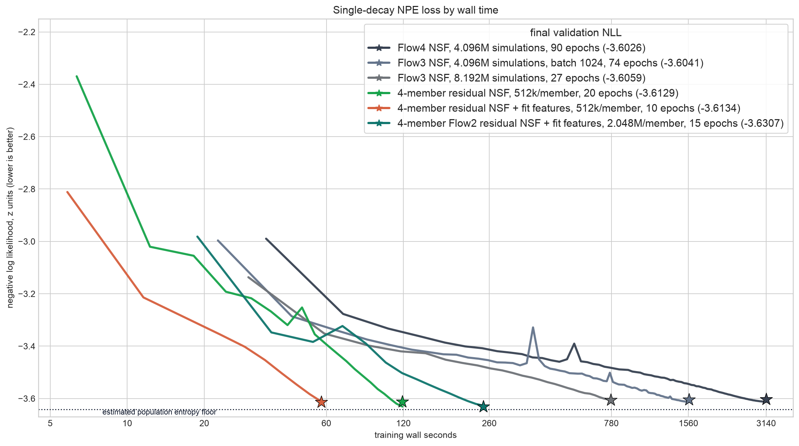

Because panel means can hide rare failures, the comparison also looks at the
full distribution of per-signal panel marginal Wasserstein values. The
metric is the same coordinate-wise diagnostic defined in the evaluation
section: for each signal, exact grid posterior marginals over $`A`$, $`k`$, and
$`\sigma`$ are compared with NPE posterior samples using normalized 1D
Wasserstein distances, then averaged over coordinates. In this subsection,
$`D_{\mathrm{panel}}`$ denotes that per-signal mean normalized marginal
Wasserstein distance.

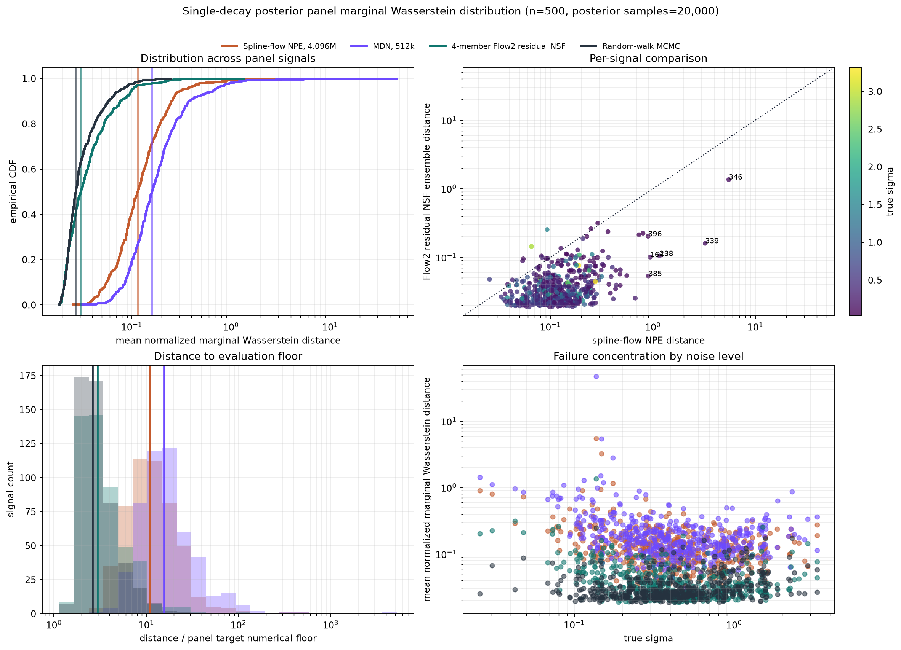

Adding exact-likelihood random-walk MCMC to the same 500-signal panel gives
median $`D_{\mathrm{panel}}`$ values of 0.0273 for MCMC, 0.0308 for the
4-member Flow2 residual NSF ensemble, 0.115 for the 4.096M conditional
spline-flow checkpoint, and 0.161 for the 512k MDN. MCMC is lowest on 274 of
500 signals, the Flow2 ensemble is lowest on 223, the spline-flow checkpoint is
lowest on 3, and the MDN is never lowest. The MCMC curve is a useful
exact-likelihood sampler diagnostic, not a replacement for the exact grid
marginals used as the reference here: 287 of 500 MCMC fits pass the current
R-hat and effective-sample-size convergence flags. The remaining outliers show
where posterior-shape diagnostics can catch issues not visible from validation
NLL alone.

### Sign-Symmetry Stress Test

This model creates a two-mode posterior by observing a squared parameter:

```math
x =
\begin{bmatrix}
\theta_1^2 \\
\theta_2
\end{bmatrix}
+ \epsilon,
\qquad
\epsilon \sim \mathcal N\!\left(
0,
\mathrm{diag}(0.22^2,0.16^2)
\right).
```

The prior is:

```math
\theta \sim \mathcal N\!\left(
0,
\mathrm{diag}(1.8^2,1.8^2)
\right).
```

The posterior is symmetric in the sign of $`\theta_1`$. Population NPE trains
directly on the symmetry-aware folded density target:

```math
z=(|\theta_1|,\theta_2).
```

The current population-trained sign estimator applies the single-decay Flow2
residual NSF recipe with minimal changes: two NSF transforms, residual
width-80 conditioners, random inter-transform permutations, cosine-step
learning-rate schedule, and 15 training epochs. The only statistical change is
the sign simulator and folded target above.

| Model | Training data | Full-prior validation NLL |
| --- | ---: | ---: |
| 4-member Flow2 residual NSF folded-target ensemble | `512k` prior-predictive pairs per member | `-1.42261 +/- 0.00117` |

The folded full-prior entropy floor is `-1.42694 +/- 0.00115`, so the measured
gap is `0.00433`, or `2.64` combined standard errors. This is close to the
population NLL floor, but it is not a statistically clean floor hit yet. The
run is documented at
[01_flow2_residual_full_prior_512k_ensemble4](runs/02_stress_sign/03_population_npe/01_flow2_residual_full_prior_512k_ensemble4/README.md).

The loss plot is generated by the same training-efficiency plotting script used
for the single-decay section, in `sign_population` mode. The run skipped
per-epoch validation, so the curves are member training NLLs in folded target
units against total training wall time; the marker is the final 1M-example
full-prior validation NLL.

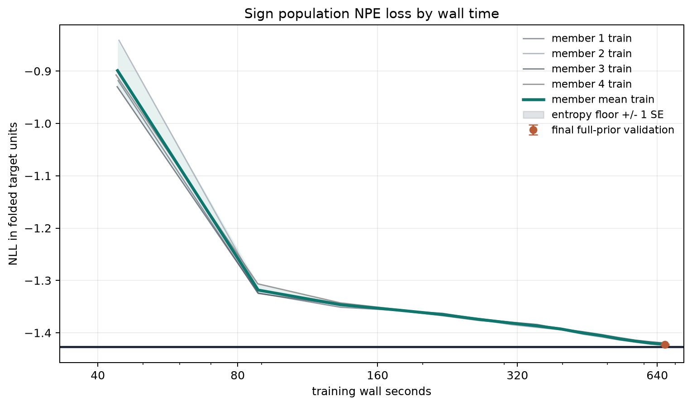

The posterior-shape check below uses the same population-trained ensemble on a
fresh full-prior signal, not the old fixed-observation sign flow. The signal was
drawn with seed `20260707`, draw index `1`, giving
$`\theta=(1.419,-1.175)`$ and $`x=(1.956,-0.932)`$. Against a dense exact grid,
mean normalized Wasserstein in folded diagnostic coordinates is `0.02112` for
MCMC and `0.02069` for the population NPE.

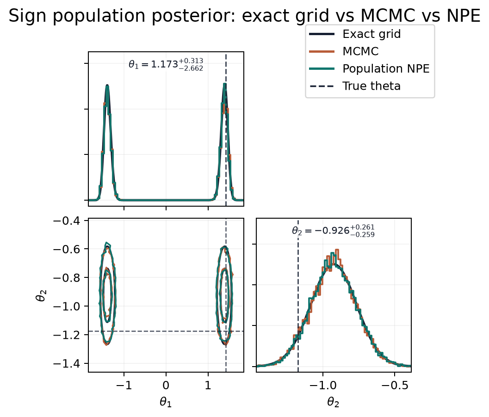

The metadata for this view is stored in
[sign_population_prior_signal_summary.json](runs/00_shared_assets/readme_sign_posteriors/sign_population_prior_signal_summary.json).

### Banana Stress Test

This model bends an otherwise simple two-dimensional posterior:

```math
x =
\begin{bmatrix}
\theta_1 \\
\theta_2 + b(\theta_1^2-c)
\end{bmatrix}
+ \epsilon,
\qquad
b=0.65,\quad c=0.70.
```

The observation noise and prior are:

```math
\epsilon \sim \mathcal N\!\left(
0,
\mathrm{diag}(0.20^2,0.18^2)
\right),
\qquad
\theta \sim \mathcal N\!\left(
0,
\mathrm{diag}(1.8^2,1.8^2)
\right).
```

The benchmark observation is generated from:

```math
\theta_0=(0.90,-0.25).
```

The diagnostic and full-prior NLL target coordinates are the raw coordinates:

```math
g(\theta)=(\theta_1,\theta_2).
```

The population-trained Banana estimator applies the same Flow2 residual NSF
recipe used for sign and Linear6. The context includes raw $`x`$, the dewarped
summary $`x_2-b(x_1^2-c)`$, and the curvature term $`x_1^2-c`$; the density
target remains raw $`\theta`$.

| Model | Training data | Full-prior validation NLL |
| --- | ---: | ---: |
| 4-member Flow2 residual NSF ensemble | `512k` prior-predictive pairs per member | `-0.52753 +/- 0.00100` |

The Banana full-prior entropy floor in the same raw coordinates is
`-0.52826 +/- 0.00100`, computed by integrating $`\theta_2`$ analytically and
using one-dimensional Gauss-Hermite evidence integration over $`\theta_1`$.
The measured gap is `0.00073`, only `0.52` combined standard errors, so this is
a full-prior floor pass under the common criterion. The paired 1M-example cache
still resolves the tiny residual gap (`0.00073 +/- 0.00004`), so the result is
not literally zero-bias, but the absolute gap is much smaller than the
single-decay, sign, and Linear6 population gaps.

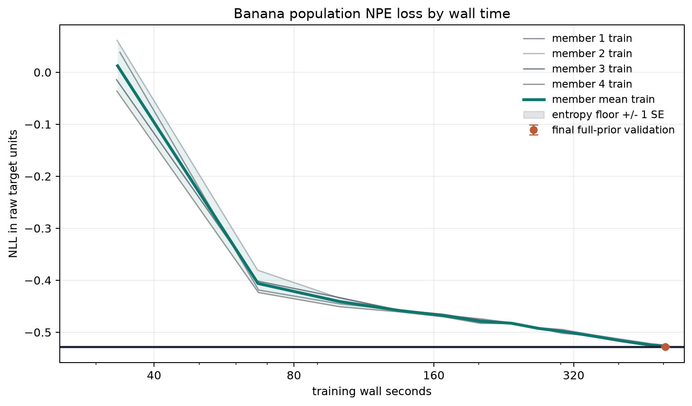

The posterior-shape check below uses a fresh full-prior signal and overlays
exact grid, MCMC, and the population-trained NPE in the same raw coordinates.
Against exact posterior samples, the NPE mean normalized marginal Wasserstein
distance is `0.01025`; the MCMC reference is `0.01188`.

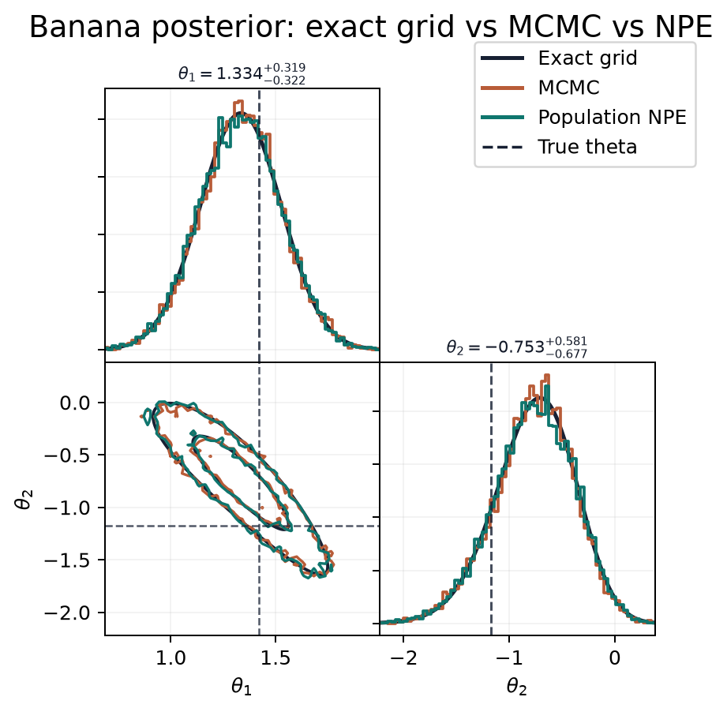

The run is documented at
[01_flow2_residual_full_prior_512k_ensemble4](runs/03_stress_banana/03_population_npe/01_flow2_residual_full_prior_512k_ensemble4/README.md).

### Label-Switching Mixture

This model tests whether the density estimator handles a discrete symmetry in
the posterior. The likelihood has exchangeable component labels:

```math
x_i \sim
\frac{1}{2}\mathcal N(\mu_1,\sigma^2)
+
\frac{1}{2}\mathcal N(\mu_2,\sigma^2),
\qquad
i=1,\ldots,80.
```

The full-prior population NPE trains and evaluates in sorted log-noise
coordinates:

```math
z_{\mathrm{sorted}}=(\mu_{\mathrm{low}},\mu_{\mathrm{high}},\log\sigma),
\qquad
\mu_{\mathrm{low}}=\min(\mu_1,\mu_2),
\quad
\mu_{\mathrm{high}}=\max(\mu_1,\mu_2).
```

The raw prior is:

```math
z=(\mu_1,\mu_2,\log\sigma),
\qquad
z \sim \mathcal N\!\left(
(0,0,\log 0.45),
\mathrm{diag}(2.2^2,2.2^2,0.55^2)
\right).
```

The NLL target stays in `log_sigma` units. Physical `sigma` can still be used
for displays, but the population NLL and entropy floor are reported in the
same sorted log-coordinate density.

The new population run reuses the single-decay/sign Flow2 residual NSF recipe
with minimal model-specific changes. The context is a compact set of raw-data,
quantile, moment, and EM-like mixture summaries, while the target is the sorted
coordinate vector above.

| Run | Training examples per member | Epochs | Full-prior validation NLL | Entropy floor | Gap |
| --- | ---: | ---: | ---: | ---: | ---: |
| 4-member Flow2 residual NSF ensemble | `512k` | `30` | `-3.09250 +/- 0.00822` | `-3.10112 +/- 0.00821` | `0.00862` |

The gap is only `0.74` combined standard errors, so this is at the same
practical near-floor level as the single-decay, sign, and Linear6 population
runs. Because the NPE and floor are evaluated on the same validation cache, the
paired comparison still resolves a small remaining gap:
`0.00862 +/- 0.00060`. This should be described as `near_floor`, not an exact
floor hit.

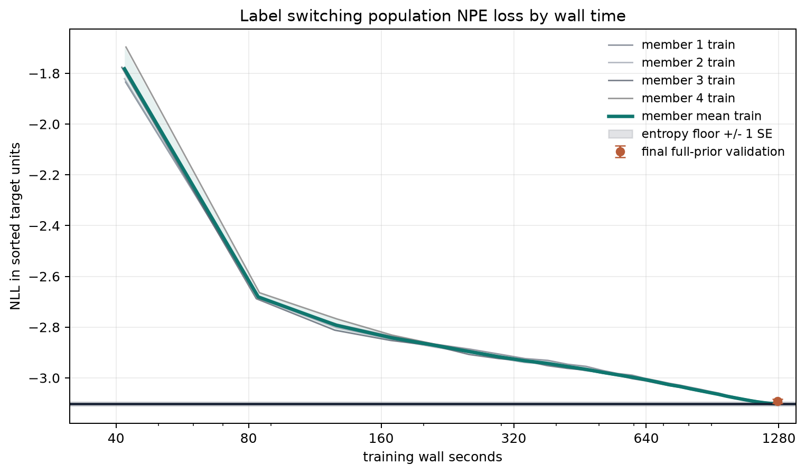

For a fresh full-prior diagnostic signal, the sorted-coordinate NPE posterior
overlays an exact finite grid and an MCMC reference. Mean normalized marginal
Wasserstein distance to the exact grid is `0.02729` for the NPE and `0.02979`
for MCMC; the NPE-to-MCMC diagnostic is `0.02365`.

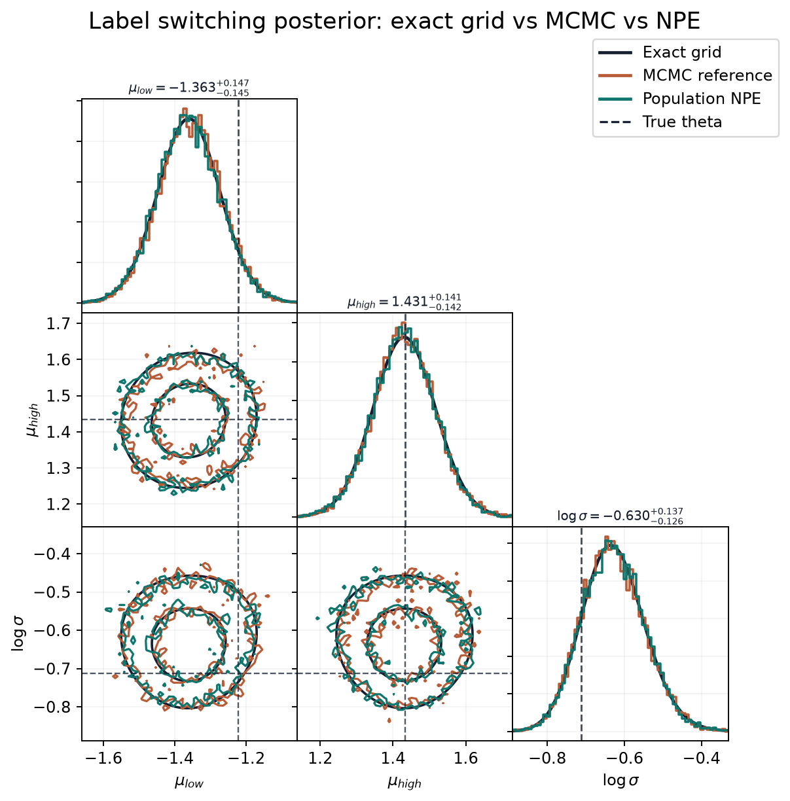

The run is documented at
[02_flow2_residual_full_prior_512k_ensemble4_e30](runs/04_stress_label_switch/03_population_npe/02_flow2_residual_full_prior_512k_ensemble4_e30/README.md).

### Linear6 Stress Test

This model tests smooth higher-dimensional inference. The simulator is:

```math
y_i =
\sum_{j=1}^{6} w_j \phi_j(t_i)
+ \epsilon_i,
\qquad
\epsilon_i \sim \mathcal N(0,\sigma^2),
\qquad
i=1,\ldots,32.
```

The basis functions are an orthonormalized version of:

```math
1,\quad
t-\frac{1}{2},\quad
\sin(2\pi t),\quad
\cos(2\pi t),\quad
\sin(4\pi t),\quad
\cos(4\pi t).
```

The parameterization and prior are:

```math
z=(w_1,\ldots,w_6,\log\sigma),
\qquad
w_j \sim \mathcal N(0,1.25^2),
\qquad
\log\sigma \sim \mathcal N(\log 0.25,0.50^2).
```

The benchmark observation is generated from:

```math
(w_1,\ldots,w_6,\sigma)
=
(0.70,-0.35,0.80,-0.20,0.35,0.12,0.20).
```

The legacy local diagnostic coordinates are:

```math
g(z)=(w_1,\ldots,w_6,\sigma).
```

For the full-prior population NLL result, the density target is instead the
training coordinate vector:

```math
z=(w_1,\ldots,w_6,\log\sigma).
```

The population-trained Linear6 estimator applies the same Flow2 residual NSF
recipe used for sign with minimal changes: two NSF transforms, residual
width-80 conditioners, random inter-transform permutations, cosine-step
learning-rate schedule, and 15 epochs.

| Model | Training data | Full-prior validation NLL |
| --- | ---: | ---: |
| 4-member Flow2 residual NSF ensemble | `512k` prior-predictive pairs per member | `-10.77984 +/- 0.00353` |

The Linear6 full-prior entropy floor in the same $`z`$ coordinates is
`-10.78631 +/- 0.00353`, computed from the exact linear-Gaussian conditional
posterior with one-dimensional Gauss-Hermite evidence integration over
$`\log\sigma`$. The measured gap is `0.00647`, so this is a near-floor
global result at the same practical level as the single-decay and sign
population NPEs, but it is still not an exact floor hit. The paired gap on the
same 1M validation examples is precisely resolved, so the remaining gap should
be treated as real model bias unless a larger ensemble or data scale closes it.

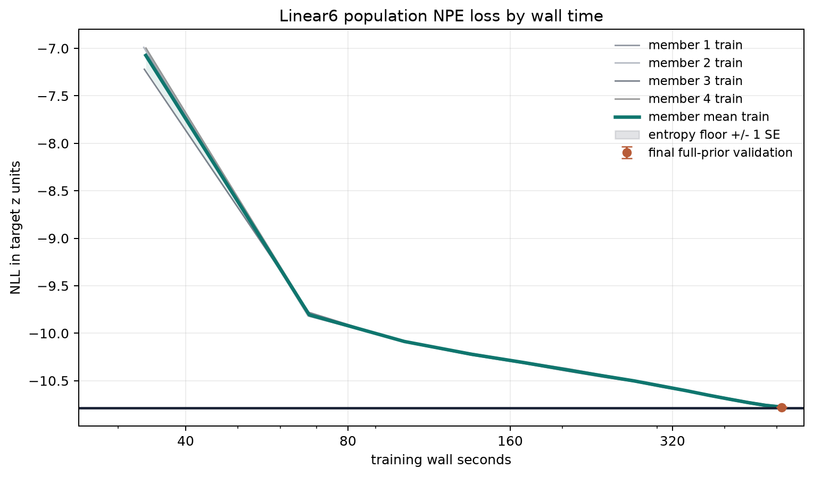

The posterior-shape check below uses the same population-trained ensemble on a
fresh full-prior signal, in the NLL target coordinates including
$`\log\sigma`$. Against exact posterior samples, the mean normalized marginal
Wasserstein distance is `0.01218`.

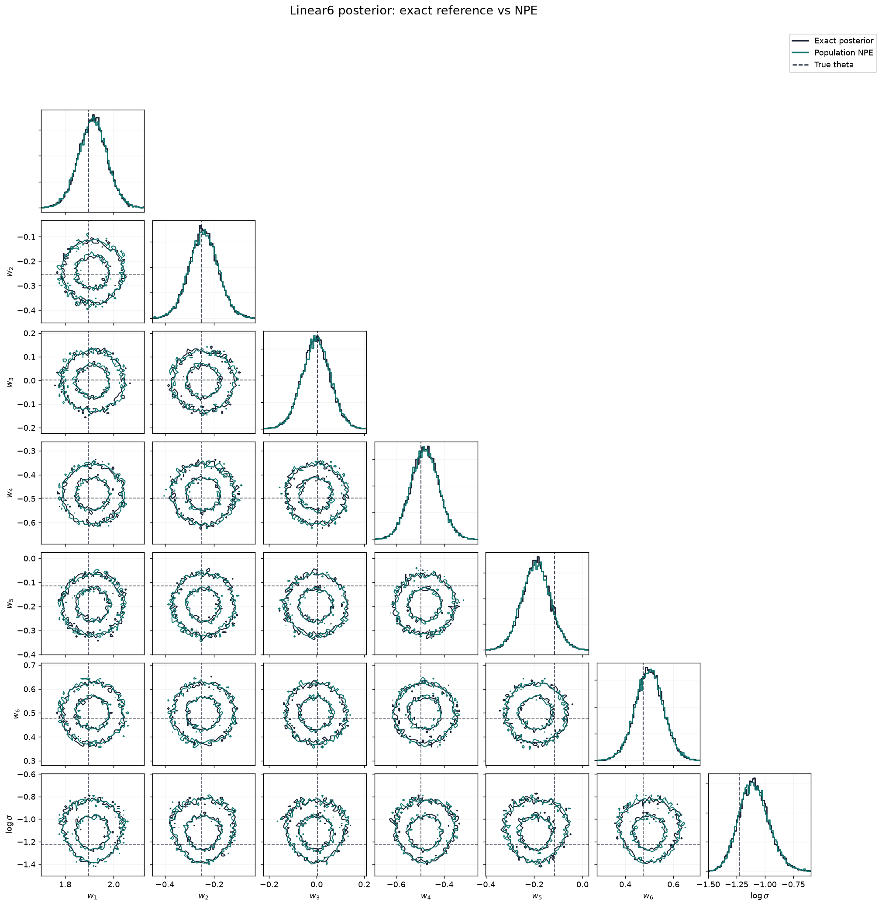

The run is documented at
[01_flow2_residual_full_prior_512k_ensemble4](runs/05_stress_linear6/03_population_npe/01_flow2_residual_full_prior_512k_ensemble4/README.md).

### Ordered Two-Exponential Decay

This model is the current hard case:

```math
y_i =
A_1\exp(-k_1 t_i)
+
A_2\exp(-k_2 t_i)
+
\epsilon_i,
\qquad
\epsilon_i \sim \mathcal N(0,\sigma^2).
```

The ordered variant enforces $`k_2>k_1`$ through the code parameterization:

```math
z=(\log A_1,\log k_1,\log A_2,\log\Delta k,\log\sigma),
\qquad
k_2 = k_1 + \Delta k,
\qquad
\Delta k=\exp(\log\Delta k).
```

The current ordered prior is:

```math
z \sim \mathcal N\!\left(
(\log 2.5,\log 0.35,\log 1.4,\log 0.75,\log 0.25),
\mathrm{diag}(0.60^2,0.55^2,0.65^2,0.60^2,0.45^2)
\right).
```

The benchmark observation is generated from:

```math
(A_1,k_1,A_2,k_2,\sigma)
=
(2.7,0.32,1.35,1.22,0.18).
```

The diagnostic coordinates are the displayed physical parameters:

```math
g(z)=(A_1,k_1,A_2,k_2,\sigma).
```

Full-prior population NPE is still unresolved. The common reference floor in the
ridge target coordinates remains `-3.28149 +/- 0.02423` NLL on the shared 10k
validation cache. A larger 50k-cache cross-check with `32768` importance samples
per signal gives `-3.27756 +/- 0.01072`, consistent with that common floor. A
250k-cache run with only `8192` importance samples per signal gave a lower
`-3.32453 +/- 0.00484`, but its per-signal importance ESS diagnostics are weak,
so it is not used as the table reference. The best trained architecture is still
the 4-member Flow2 ridge-target ensemble at 30 epochs, at `0.08257` NLL above
the common floor. A post-hoc equal-weight mixture with the high-SNR weighted
member improves only to `0.08064` above the same floor. The table below
normalizes every completed probe to that common reference floor; per-run floor
estimates in some artifacts differ and are not used for this comparison.

| Population NPE probe | Validation NLL | Gap to common floor |
| --- | ---: | ---: |
| Flow2 residual target, 512k x4, 15 epochs | `-3.19227` | `0.08923` |
| Flow2 ridge target, 512k x4, 15 epochs | `-3.19327` | `0.08823` |
| Flow2 ridge target, 512k x4, 30 epochs | `-3.19892` | `0.08257` |
| Flow2 ridge target, 1.024M x1, 30 epochs | `-3.19045` | `0.09104` |
| Flow4 h128 ridge target, 512k x1, 30 epochs | `-3.17108` | `0.11041` |
| Flow4 h128 linear-residual target, 2.048M x1, validation-selected 30 epochs | `-2.78417` | `0.49732` |
| MAF4 ridge target, 512k x1, 30 epochs | `-3.17836` | `0.10314` |
| MDN8 ridge target, 128k x1, 20 epochs | `-3.01387` | `0.26762` |
| Flow2 augmented context, 512k x1, 30 epochs | `-3.17555` | `0.10595` |
| 2-component Flow2 mixture, 512k x1, 30 epochs | `-3.17577` | `0.10572` |
| Flow2 rate-sum target, 512k x1, 30 epochs | `-3.17315` | `0.10834` |
| Flow2 high-SNR weighted ridge target, 512k x1, 30 epochs | `-3.16299` | `0.11851` |
| Equal-5 mixture: Flow2 ridge x4 + high-SNR weighted x1 | `-3.20086` | `0.08064` |
| 4-component Flow2 mixture, h96, 512k x1, validation-selected 80 epochs | `-3.13618` | `0.14531` |
| Flow2 profile-residual target, 512k x1, validation-selected 80 epochs | `-2.36705` | `0.91444` |
| Flow2 NAF ridge target, 512k x1, validation-selected 80 epochs | `-3.17602` | `0.10547` |

The miss is therefore not explained by one short run or by the first floor
estimate. Scaling the same Flow2 recipe to 1.024M simulations, increasing flow
depth, running a 2.048M-simulation Flow4 linear-residual target with
validation-selected checkpointing, trying MAF, adding a simple two-component
flow mixture, adding the tested augmented context, switching to the tested
rate-sum target, upweighting the high-SNR prior tail, increasing the flow
mixture to four components, residualizing around the two-exponential profile
fit, and switching the direct-target flow kind to NAF have all stayed well above
the full-prior floor. The NAF run reached `-3.20261` on its training validation
cache, but the held-out full-prior evaluation was only `-3.17602`, so it does
not improve the current best result.

Posterior-shape diagnostics below use the current best-NLL equal-5 mixture,
not the old fixed-signal artifact. The easy case is an ordinary full-prior
prior-predictive draw. The difficult case follows the single-decay convention:
a low-prior-density stress draw, here `4.27` prior standard deviations from the
raw prior mean with log prior density `9.125` below the prior mean. Because this
posterior is five-dimensional, the visual reference is long MCMC rather than a
grid. The NPE mean normalized marginal Wasserstein distance to MCMC is `0.0417`
on the easy case and `0.0599` on the difficult case.

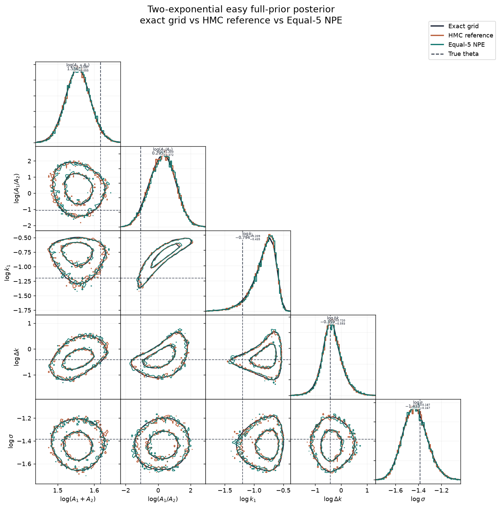

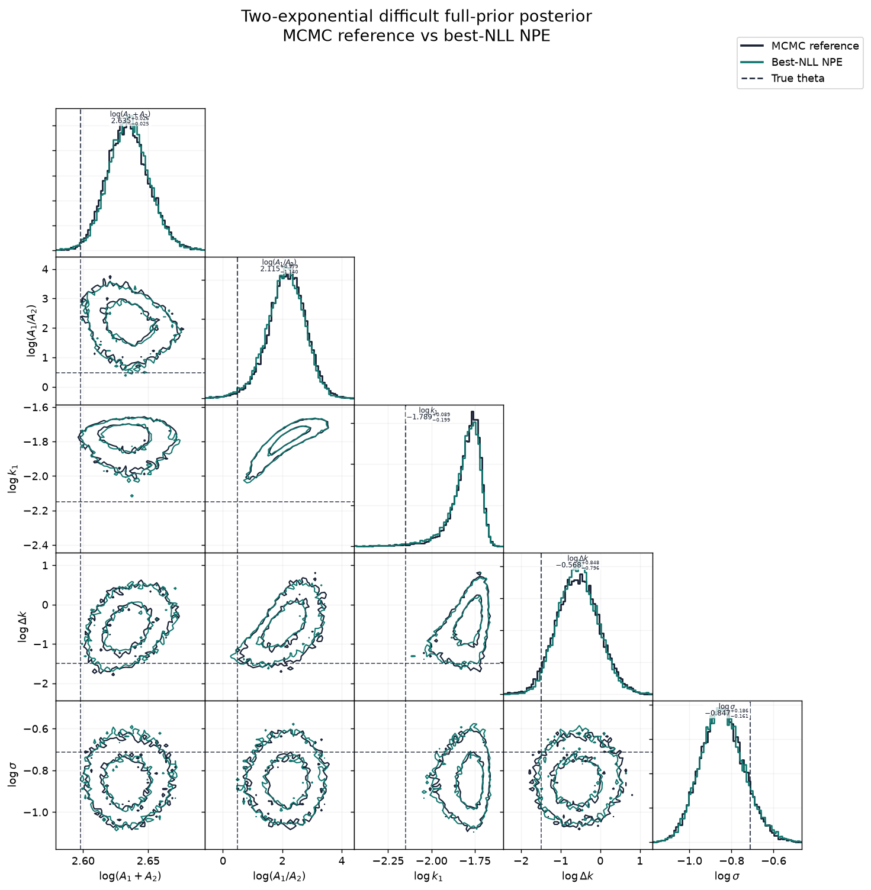

The generated metadata for these two diagnostic views is stored in
[two_exp_best_nll_posterior_summary.json](runs/00_shared_assets/readme_two_exp_posteriors/two_exp_best_nll_posterior_summary.json).

## Main Reports

- [NPE faithfulness investigation report](notes/npe-faithfulness-investigation-report.md)
- [NPE flow stress-test results](notes/npe-flow-stress-test-results.md)
- [Sign target calibration](notes/sign-target-calibration.md)
- [ABC faithfulness repair results](notes/abc-faithfulness-repair-results.md)
- [Calibrated successful and reference runs](runs/00_successful_runs/README.md)
- [All run statuses](runs/README.md)

## Common Commands

Run Python scripts with `uv run`:

```sh
uv run scripts/check_faithfulness_target.py
uv run scripts/calibrate_sign_target.py
uv run scripts/npe_flow_stress_tests.py --help
uv run scripts/build_runs_view.py
```

## UI Summary

The interactive posterior viewer supports the single-exponential decay
diagnostics. It lets you draw signals, toggle the current population-trained NPE layers,
compare against grid and MCMC references, and inspect corner plots, predictive
plots, posterior quantiles, low-prior signal stress cases,
Wasserstein-to-grid distances, and runtime diagnostics.

To run the built viewer:

```sh
cd viewer-ui
npm install
npm run build
cd ..
uv run scripts/npe_posterior_viewer.py
```

To view the built UI from the Pixel, keep Tailscale enabled on the phone and
run:

```sh
scripts/start_posterior_viewer_phone.sh
```

The script builds `viewer-ui/dist`, binds the viewer to the MacBook Tailnet
address when available, and prints the phone URL. Override `HOST`, `PUBLIC_HOST`,
or `PORT` if you need a LAN address or alternate port.

For frontend development, run the backend and Vite dev server separately:

```sh
uv run scripts/npe_posterior_viewer.py
```

```sh
cd viewer-ui
npm run dev
```

For phone-based frontend development, keep the backend running locally and use
the Tailnet URL printed by Vite:

```sh
cd viewer-ui
npm run dev:phone
```
