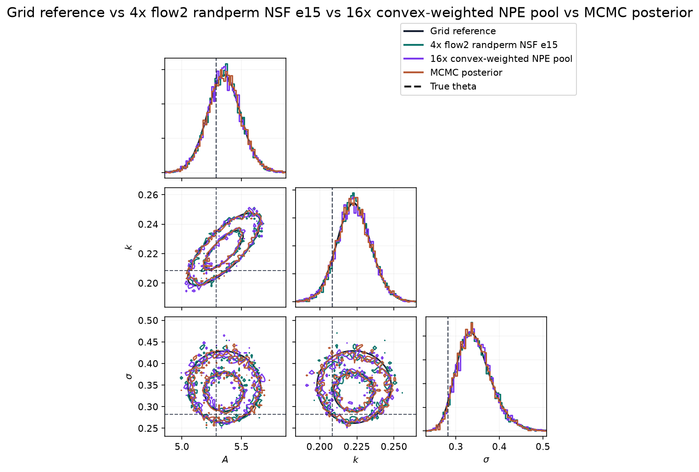
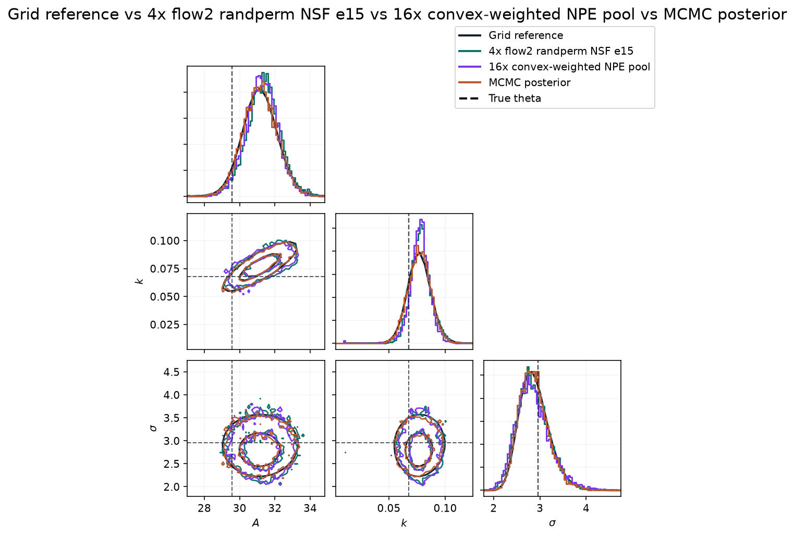
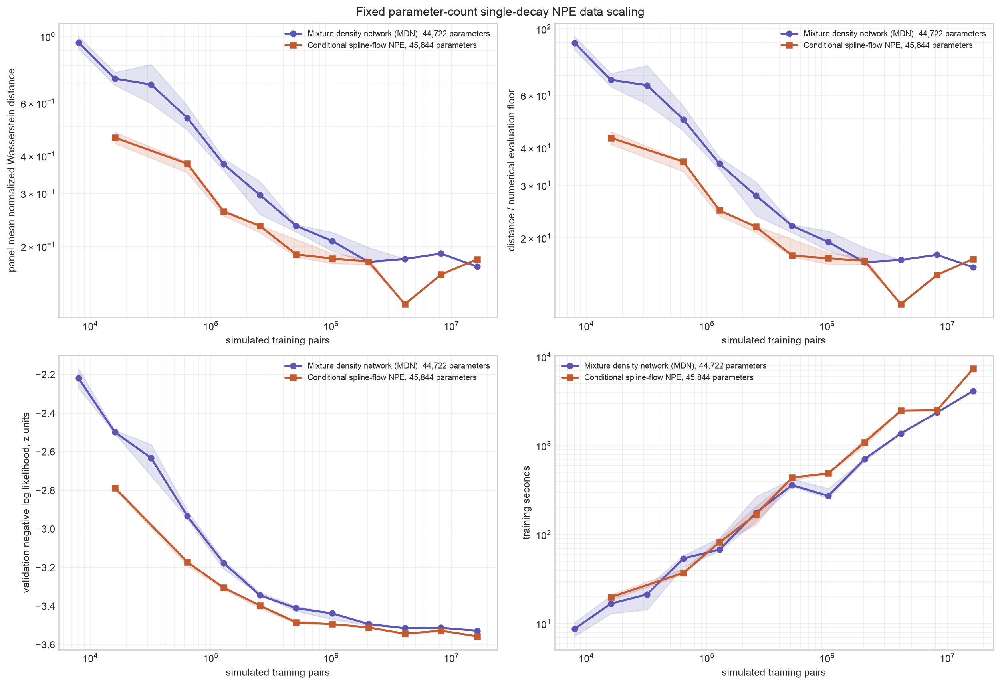
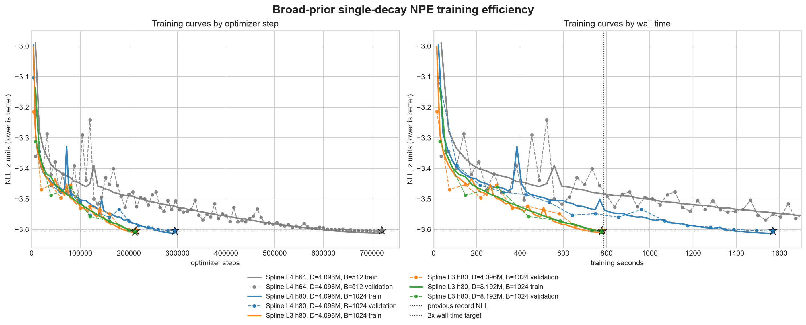
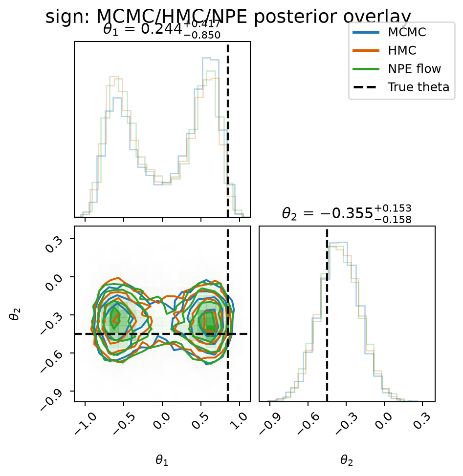
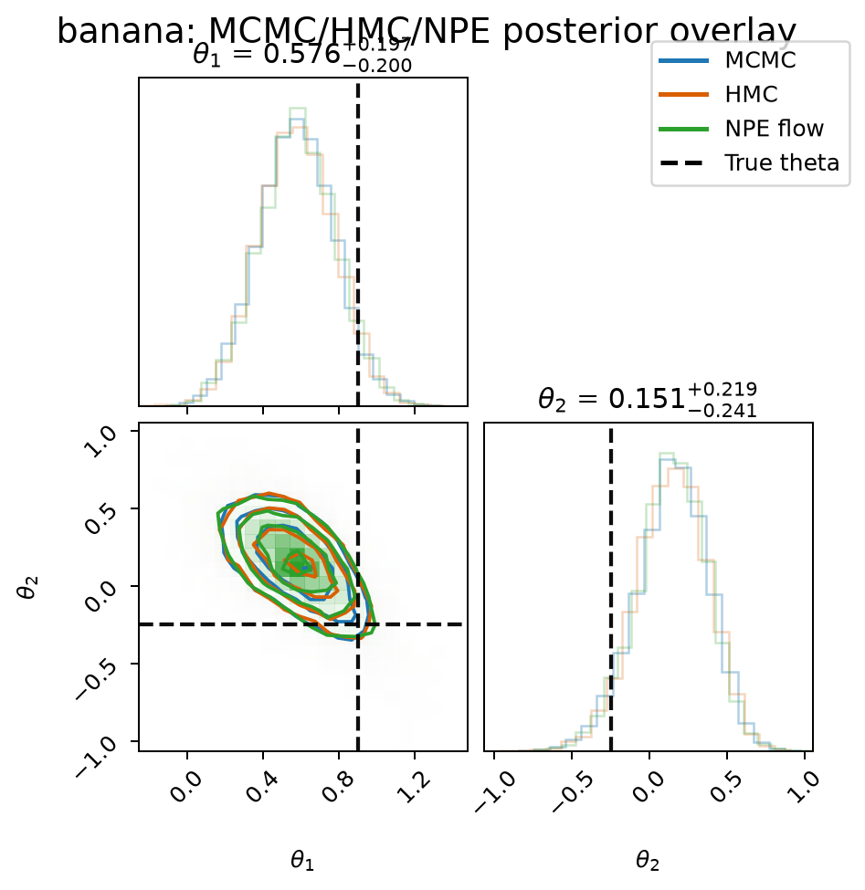
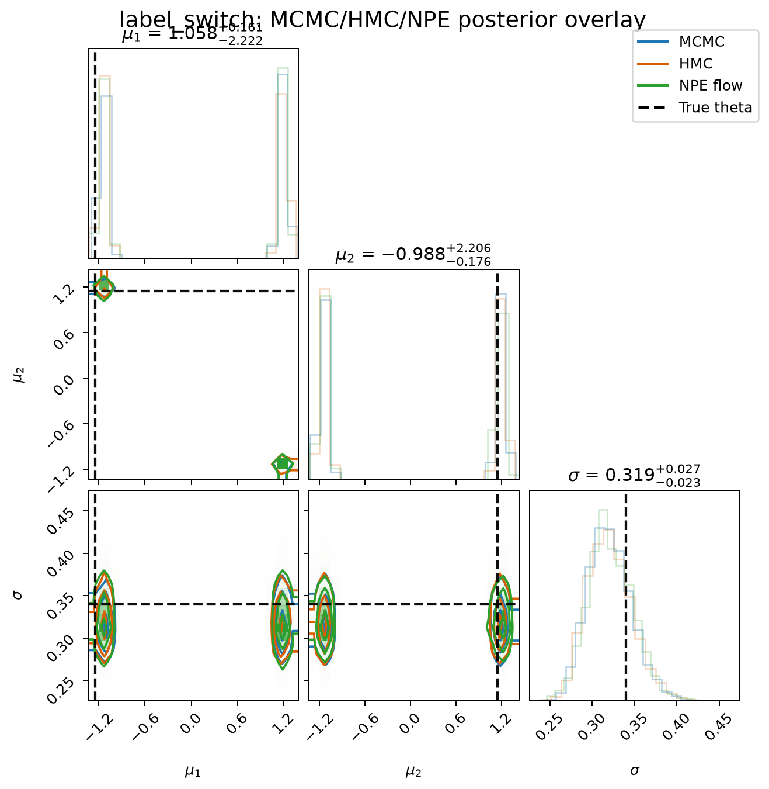
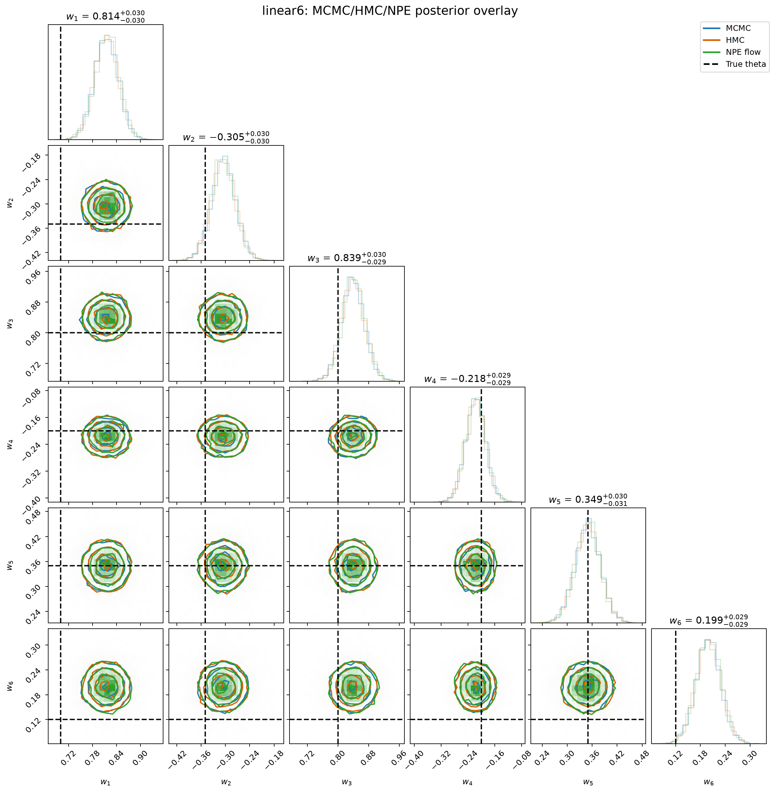
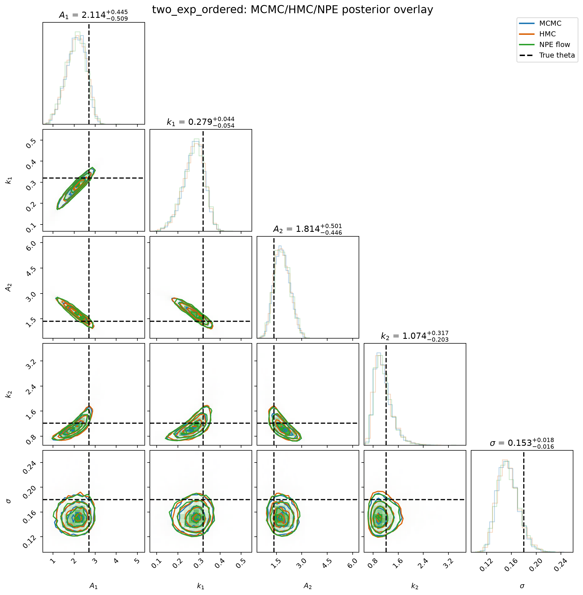

# Neural Posterior Estimation Faithfulness Tests

This repository studies neural posterior estimation (NPE) on small
simulation-based inference problems. The experiments train neural conditional
density estimators and compare their posteriors with independent posterior
references.

The basic simulator setup is:

```math
\theta \sim p(\theta), \qquad x \sim p(x \mid \theta).
```

For a requested observed signal $x_\star$, the Bayesian target is:

```math
p(\theta \mid x_\star)
=
\frac{p(x_\star \mid \theta)p(\theta)}
{\int p(x_\star \mid \vartheta)p(\vartheta)\,d\vartheta}.
```

NPE trains a conditional density estimator $q_\phi(\theta \mid x)$ from
simulated pairs:

```math
\max_\phi\;
\mathbb E_{\theta \sim p(\theta),\,x \sim p(x \mid \theta)}
\left[\log q_\phi(\theta \mid x)\right].
```

After training, the object under test is $q_\phi(\theta \mid x_\star)$.

## Evaluation

The reference posterior is computed with exact numerical grids where dimension
permits it, exact-likelihood random-walk Metropolis MCMC, and exact-likelihood
HMC. MCMC and HMC use the same prior and likelihood as the simulator under
test.

For a diagnostic parameterization $g(\theta)$, the main scalar comparison is
mean marginal normalized Wasserstein distance:

```math
D(q, p_{\mathrm{ref}})
=
\frac{1}{d}
\sum_{j=1}^{d}
\frac{
W_1\!\left(g_j(\theta_q), g_j(\theta_{\mathrm{ref}})\right)
}{
\mathrm{sd}_{p_{\mathrm{ref}}}\!\left(g_j(\theta)\right)
}.
```

The symbols in this diagnostic are:

- $p_{\mathrm{ref}}(\theta \mid x_\star)$: the reference posterior for the
  requested observed signal $x_\star$.
- $q(\theta \mid x_\star)$: the learned posterior being evaluated, usually an NPE
  flow posterior.
- $\theta_q$: samples drawn from $q(\theta \mid x_\star)$.
- $\theta_{\mathrm{ref}}$: samples drawn from, or weighted grid points
  representing, $p_{\mathrm{ref}}(\theta \mid x_\star)$.
- $g(\theta)$ is the diagnostic parameterization used for comparison; it may
  be the raw parameter vector, a physical-parameter transform, or a
  symmetry-aware transform. $g_j(\theta)$ is coordinate $j$ of that diagnostic
  vector, and $d$ is the number of diagnostic coordinates.
- $W_1(a,b)$: the one-dimensional Wasserstein-1 distance between two scalar
  distributions. For distributions with cumulative distribution functions
  $F_a$ and $F_b$, it is:

```math
W_1(a,b)
=
\int_{-\infty}^{\infty}
\left|F_a(t)-F_b(t)\right|\,dt.
```

  Equivalently, using quantile functions $F_a^{-1}$ and $F_b^{-1}$:

```math
W_1(a,b)
=
\int_0^1
\left|F_a^{-1}(u)-F_b^{-1}(u)\right|\,du.
```

  In the run summaries, $a$ and $b$ are empirical one-dimensional sample sets
  or weighted grid marginals for one diagnostic coordinate.
- $\mathrm{sd}_{p_{\mathrm{ref}}}(g_j(\theta))$: the posterior standard
  deviation of diagnostic coordinate $j$ under the reference posterior.

The division by the reference standard deviation turns each coordinate's
Wasserstein distance into a scale-free error. The final value averages those
coordinate errors, so parameters measured on different numerical scales can be
reported in one summary.

The diagnostic parameterization is usually the raw parameter vector. Symmetric
models use transformed coordinates such as
$\left(|\theta_1|,\theta_2\right)$ or
$\left(\mu_{\mathrm{low}},\mu_{\mathrm{high}},\sigma\right)$ so that sampler
diagnostics measure posterior shape independently of arbitrary label
assignments.

Each serious run also records acceptance rates, rank-normalized `Rhat`, bulk
and tail effective sample size, trace plots, posterior summaries, corner
overlays, and posterior predictive overlays when the simulator generates
curves.

## Starting A New Model

Begin by writing down the statistical problem before changing code. A new test
case should have a prior, simulator, observation rule, diagnostic coordinates,
and reference plan:

```math
\theta \sim p(\theta),
\qquad
x \sim p(x\mid\theta),
\qquad
x_\star = f(\theta_\star,\epsilon_\star).
```

The posterior target for the requested signal $x_\star$ is:

```math
p(\theta\mid x_\star)
\propto
p(x_\star\mid\theta)p(\theta).
```

Define the parameterization used for numerical comparison at the same time:

```math
g:\Theta\to\mathbb R^d.
```

For an identifiable model, $g(\theta)$ is often the raw parameter vector. For a
model with signs, labels, ridges, or ordered components, choose $g$ so that the
comparison measures the statistical posterior rather than an arbitrary
coordinate convention.

Then implement the smallest exact-likelihood test loop that can answer whether
NPE is faithful:

1. Add the simulator, prior sampler, likelihood, context summary, display
   transform, and diagnostic transform. Simple stress tests usually belong in
   `scripts/npe_flow_stress_tests.py`; decay-style models with specialized
   references can use a dedicated script.
2. Pick a truth $\theta_\star$ and generate one observed signal $x_\star$. Keep
   this signal fixed while comparing methods, otherwise the reference target is
   changing between runs.
3. Build an independent reference posterior. Use a grid when $d$ is small
   enough for direct quadrature; otherwise use exact-likelihood MCMC or HMC and
   check trace behavior, acceptance, `Rhat`, and effective sample size.
4. Run a smoke NPE experiment first. It should verify that the simulator,
   context, neural posterior, sampling code, and plotting code all work before
   spending time on a larger run.
5. Run the serious NPE fit and compare posterior samples with the reference
   using the normalized Wasserstein diagnostic $D(q,p_{\mathrm{ref}})$ already
   defined above. Inspect marginal overlays, corner plots, posterior
   predictive overlays, and any model-specific mode or symmetry diagnostics.
6. Decide the run status from the reference comparison. A passing run should
   match the posterior target in the diagnostic coordinates and should not rely
   only on visually plausible predictive curves.
7. Record the run command, target, metric, plots, and conclusion in the run
   README, then update the root README only when the result changes the
   project-level understanding of that model.

Useful entry points are:

```sh
uv run scripts/npe_flow_stress_tests.py --help
uv run scripts/check_faithfulness_target.py
uv run scripts/build_runs_view.py
```

## Models And Progress

### Single-Exponential Decay

The base model is a noisy exponential decay curve:

```math
y_i = A\exp(-k t_i) + \epsilon_i,
\qquad
\epsilon_i \sim \mathcal N(0,\sigma^2).
```

The parameter vector is $\theta=(A,k,\sigma)$. The code samples and evaluates
the posterior in log coordinates:

```math
z=(\log A,\log k,\log\sigma),
\qquad
z \sim \mathcal N\!\left(
\log(4.0,0.50,0.40),
\mathrm{diag}(0.8^2,0.8^2,0.8^2)
\right).
```

The current single-decay result is broad prior-amortized NPE. The estimator is
trained over the full simulator population:

```math
p_{\mathrm{broad}}(\theta,x)=p(\theta)p(x\mid\theta),
```

with objective

```math
\phi_{\mathrm{broad}}
=
\arg\max_\phi
\mathbb E_{(\theta,x)\sim p_{\mathrm{broad}}}
\left[
\log q_\phi(\theta\mid x)
\right].
```

The main UI exposes two current broad-prior NPEs:

| Model | Role | Full validation NLL |
| --- | --- | ---: |
| 4x flow2 randperm residual NSF, raw-decay-fit context, 2.048M/member x 15 epochs | Fresh end-to-end training proof under the five-minute budget. | `-3.6306901328125` |
| 16x convex-weighted saved-checkpoint pool | Lower-NLL reference assembled from saved broad NPE checkpoints. | `-3.63128073481036` |

The following prior-predictive signal shows the current broad NPE overlays
against exact grid and MCMC references. Mean normalized Wasserstein to the grid
is `0.0662` for the fresh 4x flow2 ensemble, `0.0648` for the weighted pool,
and `0.0646` for MCMC.



[Single decay broad-prior signal predictive overlay](runs/00_shared_assets/readme_decay_posteriors/decay_broad_prior_posterior_signal.png)

The very-low-prior stress signal is harder. The fresh 4x flow2 ensemble has
mean normalized Wasserstein `0.2195`, the weighted pool has `0.2864`, and MCMC
has `0.0884`. This is a useful counterexample to relying only on average NLL.



[Single decay very-low-prior signal predictive overlay](runs/00_shared_assets/readme_decay_posteriors/decay_broad_low_prior_stress_posterior_signal.png)

The generated metadata for these diagnostic views is stored in
[decay_broad_readme_posteriors_summary.json](runs/00_shared_assets/readme_decay_posteriors/decay_broad_readme_posteriors_summary.json).

#### Fixed-P Scaling Diagnostic

The older fixed-P experiment below is the scaling-law diagnostic: it holds the
architecture family roughly fixed and scales the number of prior-predictive
training pairs $D$. The later gains are not scaling-law evidence. They came from
architecture, context-feature, schedule, HPO, ensembling, and convex-weighting
changes on the broad-prior validation objective.

The fixed-P scaling plot compares an MDN and a conditional spline flow with
about 45k parameters each. It reports both validation NLL over broad prior
samples and panel marginal Wasserstein over cached exact grid marginals for a
fixed panel of signals.



The log-log panels show useful scaling with $D$ through the tested range up to
16.384M simulations, but the panel Wasserstein remains far above the numerical
evaluation floor. This is only a fixed-architecture scaling diagnostic; it is
not the source of the current best broad-prior models.

#### Population Entropy Floor

For the broad-prior validation NLL, the Bayes-optimal density is the exact
posterior $p(\theta\mid x)$. The irreducible loss is the conditional population
entropy:

```math
\mathcal L_\star
=
\mathbb E_{p(\theta,x)}
\left[
-\log p(\theta\mid x)
\right]
=
H(\theta\mid X).
```

The current adaptive oracle estimate recorded in
[npe-next-2x-efficiency-decision-diary.md](notes/npe-next-2x-efficiency-decision-diary.md)
is approximately `-3.64122 +/- 0.008` in $z$ units. That is the estimated
population-NLL floor for broad prior-amortized validation.

The reported model NLLs are measured on a finite 1M-example validation cache.
Per-example NLL standard-error estimates are about `0.00252`, or roughly
`+/-0.00495` for a 95% Monte Carlo half-width, for both current UI NPEs. The
fresh and weighted ensembles are therefore close enough that the weighted
pool's `0.00059` NLL advantage should not be interpreted as a resolved
population-level ordering without a larger validation estimate. The uncertainty
calculation is stored in
[decay_broad_npe_validation_nll_uncertainty.json](runs/00_shared_assets/readme_scaling/decay_broad_npe_validation_nll_uncertainty.json).

#### Training Efficiency

The wall-time plot below is not a scaling-law plot. It tracks broad-prior
single-decay training and assembly records by wall time. Curves show training
NLL where a fresh training curve exists; markers show exact full-cache NLL. The
legend labels are intentionally just the final NLL values. The teal curve is
the fresh 4-member flow2 randperm residual NSF ensemble currently exposed in
the UI (`-3.6307` in `246s`). The purple diamond is the convex-weighted
saved-checkpoint pool also exposed in the UI (`-3.6313` in `73.63s` assembly
and evaluation time); it is a point because it was weight optimization over
already saved checkpoints, not a fresh end-to-end training run.



Because panel means can hide rare failures, the current comparison also looks
at the full distribution of per-signal panel marginal Wasserstein values. The
metric is the same coordinate-wise diagnostic defined in the evaluation
section: for each signal, exact grid posterior marginals over $A$, $k$, and
$\sigma$ are compared with NPE posterior samples using normalized 1D
Wasserstein distances, then averaged over coordinates.


On this 500-signal panel, the latest 4-member flow2 randperm NSF ensemble
strongly improves the distribution relative to the older broad baselines:
median panel marginal Wasserstein is 0.0308 for the ensemble, 0.115 for the
4.096M spline checkpoint, and 0.161 for the 512k MDN. The ensemble is the best
of the three on 484 of 500 signals and beats the spline checkpoint on 485 of
500 signals. The remaining outliers are much smaller than before but still mark
where posterior-shape diagnostics can catch issues not visible from validation
NLL alone.

### Sign-Symmetry Stress Test

This model creates a two-mode posterior by observing a squared parameter:

```math
x =
\begin{bmatrix}
\theta_1^2 \\
\theta_2
\end{bmatrix}
+ \epsilon,
\qquad
\epsilon \sim \mathcal N\!\left(
0,
\mathrm{diag}(0.22^2,0.16^2)
\right).
```

The prior is:

```math
\theta \sim \mathcal N\!\left(
0,
\mathrm{diag}(1.8^2,1.8^2)
\right).
```

The benchmark observation is generated from:

```math
\theta_0=(0.85,-0.45).
```

The posterior is symmetric in the sign of $\theta_1$. The diagnostic
coordinates are:

```math
g(\theta)=(|\theta_1|,\theta_2).
```

Progress: the calibrated grid-faithful run trains the flow on
$\left(|\theta_1|,\theta_2\right)$, then restores sign symmetry by randomly assigning
the sign of $\theta_1$ after sampling. This run passes the exact-grid
diagnostic target and has good mode-mass behavior.

Best posterior:
[sign_absfold_q008_linear run](runs/02_stress_sign/01_npe_flow/21_npe_flow_stress_tests_sign_absfold_q008_linear/README.md).



### Banana Stress Test

This model bends an otherwise simple two-dimensional posterior:

```math
x =
\begin{bmatrix}
\theta_1 \\
\theta_2 + b(\theta_1^2-c)
\end{bmatrix}
+ \epsilon,
\qquad
b=0.65,\quad c=0.70.
```

The observation noise and prior are:

```math
\epsilon \sim \mathcal N\!\left(
0,
\mathrm{diag}(0.20^2,0.18^2)
\right),
\qquad
\theta \sim \mathcal N\!\left(
0,
\mathrm{diag}(1.8^2,1.8^2)
\right).
```

The benchmark observation is generated from:

```math
\theta_0=(0.90,-0.25).
```

The diagnostic coordinates are the raw coordinates:

```math
g(\theta)=(\theta_1,\theta_2).
```

Progress: the best run has MCMC, HMC, and NPE in close pairwise agreement and
uses a tighter proposal/training region with linear target adjustment. It is currently
a legacy pairwise pass. The remaining work is model-specific calibration
against a truth/reference target.

Best posterior:
[banana_q008 run](runs/03_stress_banana/01_npe_flow/03_npe_flow_stress_tests_banana_q008/README.md).



### Label-Switching Mixture

This model has exchangeable component labels:

```math
x_i \sim
\frac{1}{2}\mathcal N(\mu_1,\sigma^2)
+
\frac{1}{2}\mathcal N(\mu_2,\sigma^2),
\qquad
i=1,\ldots,80.
```

The code parameterizes noise in log coordinates:

```math
z=(\mu_1,\mu_2,\log\sigma),
\qquad
z \sim \mathcal N\!\left(
(0,0,\log 0.45),
\mathrm{diag}(2.2^2,2.2^2,0.55^2)
\right).
```

The benchmark observation is generated from:

```math
(\mu_1,\mu_2,\sigma)=(-1.25,1.15,0.34).
```

The raw posterior is invariant to swapping $\mu_1$ and $\mu_2$. The
diagnostic coordinates sort the component means:

```math
g(z)=(\mu_{\mathrm{low}},\mu_{\mathrm{high}},\sigma),
\qquad
\mu_{\mathrm{low}}=\min(\mu_1,\mu_2),
\quad
\mu_{\mathrm{high}}=\max(\mu_1,\mu_2).
```

Progress: the best run trains in ordered coordinates, restores random label
assignment after sampling, and uses EM-based context summaries. Sorted
diagnostics pass and pairwise agreement is strong. Final status remains a
legacy pairwise pass until model-specific calibration is added.

Best posterior:
[label_em run](runs/04_stress_label_switch/01_npe_flow/05_npe_flow_stress_tests_label_em/README.md).



### Linear6 Stress Test

This model tests smooth higher-dimensional inference. The simulator is:

```math
y_i =
\sum_{j=1}^{6} w_j \phi_j(t_i)
+ \epsilon_i,
\qquad
\epsilon_i \sim \mathcal N(0,\sigma^2),
\qquad
i=1,\ldots,32.
```

The basis functions are an orthonormalized version of:

```math
1,\quad
t-\frac{1}{2},\quad
\sin(2\pi t),\quad
\cos(2\pi t),\quad
\sin(4\pi t),\quad
\cos(4\pi t).
```

The parameterization and prior are:

```math
z=(w_1,\ldots,w_6,\log\sigma),
\qquad
w_j \sim \mathcal N(0,1.25^2),
\qquad
\log\sigma \sim \mathcal N(\log 0.25,0.50^2).
```

The benchmark observation is generated from:

```math
(w_1,\ldots,w_6,\sigma)
=
(0.70,-0.35,0.80,-0.20,0.35,0.12,0.20).
```

The diagnostic coordinates are:

```math
g(z)=(w_1,\ldots,w_6,\sigma).
```

Progress: the best run has converged MCMC/HMC references and close NPE
pairwise agreement after tuning the random-walk proposal and using a tighter
proposal/training region. It is a legacy pairwise pass pending model-specific
calibration.

Best posterior:
[linear6_q008 run](runs/05_stress_linear6/01_npe_flow/13_npe_flow_stress_tests_linear6_q008/README.md).



### Ordered Two-Exponential Decay

This model is the current hard case:

```math
y_i =
A_1\exp(-k_1 t_i)
+
A_2\exp(-k_2 t_i)
+
\epsilon_i,
\qquad
\epsilon_i \sim \mathcal N(0,\sigma^2).
```

The ordered variant enforces $k_2>k_1$ through the code parameterization:

```math
z=(\log A_1,\log k_1,\log A_2,\log\Delta k,\log\sigma),
\qquad
k_2 = k_1 + \Delta k,
\qquad
\Delta k=\exp(\log\Delta k).
```

The current ordered prior is:

```math
z \sim \mathcal N\!\left(
(\log 2.5,\log 0.35,\log 1.4,\log 0.75,\log 0.25),
\mathrm{diag}(0.60^2,0.55^2,0.65^2,0.60^2,0.45^2)
\right).
```

The benchmark observation is generated from:

```math
(A_1,k_1,A_2,k_2,\sigma)
=
(2.7,0.32,1.35,1.22,0.18).
```

The diagnostic coordinates are the displayed physical parameters:

```math
g(z)=(A_1,k_1,A_2,k_2,\sigma).
```

Progress: MCMC and HMC agree well on the best current run. NPE remains outside
the reference agreement level. The best custom-flow result used a profiled
two-rate least-squares summary and a residual-centered NPE target. Further
attempts with broader and tighter proposal regions, proposal NPE, whitening,
ridge coordinates, raw-curve context, and `sbi` SNPE-C have left the gap
unresolved.

Best posterior:
[two_exp_ordered_residual run](runs/06_two_exponential/01_npe_flow/12_npe_flow_stress_tests_two_exp_ordered_residual/README.md).



## Main Reports

- [NPE faithfulness investigation report](notes/npe-faithfulness-investigation-report.md)
- [NPE flow stress-test results](notes/npe-flow-stress-test-results.md)
- [Sign target calibration](notes/sign-target-calibration.md)
- [ABC faithfulness repair results](notes/abc-faithfulness-repair-results.md)
- [Calibrated successful and reference runs](runs/00_successful_runs/README.md)
- [All run statuses](runs/README.md)

## Common Commands

Run Python scripts with `uv run`:

```sh
uv run scripts/check_faithfulness_target.py
uv run scripts/calibrate_sign_target.py
uv run scripts/npe_flow_stress_tests.py --help
uv run scripts/build_runs_view.py
```

## UI Summary

The interactive posterior viewer supports the single-exponential decay
diagnostics. It lets you draw signals, toggle the current broad NPE layers,
compare against grid and MCMC references, and inspect corner plots, predictive
plots, posterior quantiles, low-prior signal stress cases,
Wasserstein-to-grid distances, and runtime diagnostics.

To run the built viewer:

```sh
cd viewer-ui
npm install
npm run build
cd ..
uv run scripts/npe_posterior_viewer.py
```

To view the built UI from the Pixel, keep Tailscale enabled on the phone and
run:

```sh
scripts/start_posterior_viewer_phone.sh
```

The script builds `viewer-ui/dist`, binds the viewer to the MacBook Tailnet
address when available, and prints the phone URL. Override `HOST`, `PUBLIC_HOST`,
or `PORT` if you need a LAN address or alternate port.

For frontend development, run the backend and Vite dev server separately:

```sh
uv run scripts/npe_posterior_viewer.py
```

```sh
cd viewer-ui
npm run dev
```

For phone-based frontend development, keep the backend running locally and use
the Tailnet URL printed by Vite:

```sh
cd viewer-ui
npm run dev:phone
```
